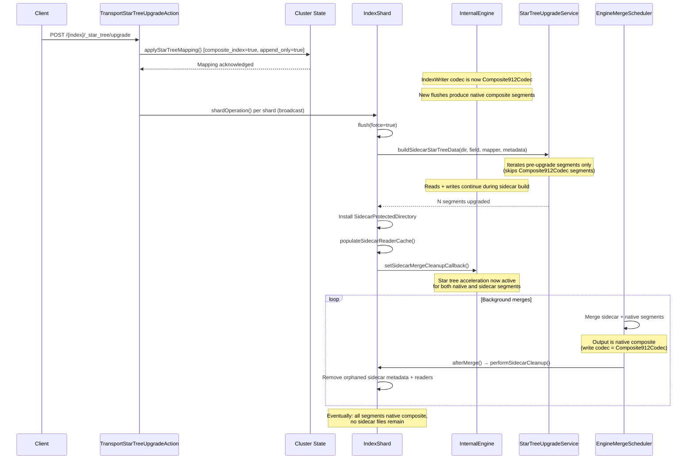
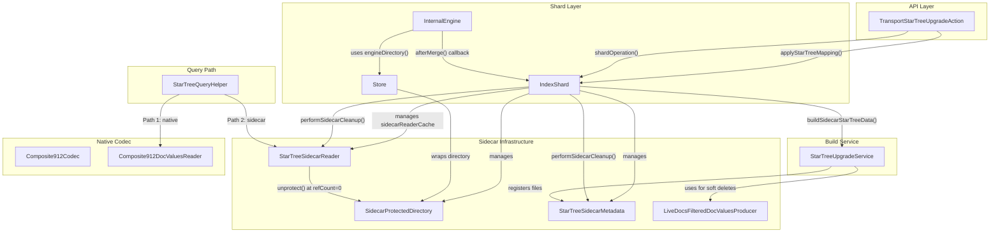

# Design Document: Hybrid Star Tree Upgrade

## Overview

The hybrid star tree upgrade combines two existing approaches — native codec switching and sidecar file building — into a single strategy that retroactively adds star tree acceleration to existing OpenSearch indices without blocking writes or requiring engine restarts.

The core insight: the mapping update (`applyStarTreeMapping()`) sets `composite_index=true` and `append_only=true` in the cluster state, which causes `IndexWriter`'s write codec to become `Composite912Codec`. After this mapping update, every new flush produces native composite segments automatically. For existing pre-upgrade segments, the sidecar path builds star tree files alongside them without modifying their codec. Background Lucene merges gradually converge sidecar segments with native composite segments — the merge output is always native composite because the write codec is `Composite912Codec`. Eventually all sidecar segments are absorbed and the index is fully native composite.

The key mechanism that makes this work: `getCandidateSegmentNames()` skips segments already using `Composite912Codec`, so the sidecar build only targets pre-upgrade segments. New documents flushed after the mapping update produce native composite segments and never enter the sidecar path.

## Architecture

The hybrid upgrade operates in three concurrent phases after a single API call:



### Three-Phase Lifecycle

1. **Mapping Update (Immediate)**: Cluster state update enables `Composite912Codec` as the write codec. New data immediately produces native composite segments. Writes are never blocked.

2. **Sidecar Build (Concurrent)**: `StarTreeUpgradeService.buildSidecarStarTreeData()` builds star tree files for pre-upgrade segments as sidecar files. The engine stays live — reads and writes continue. Sidecar files are protected from `IndexWriter` GC by `SidecarProtectedDirectory`.

3. **Merge Convergence (Background)**: Lucene's background merge policy gradually merges sidecar segments with native composite segments. Each merge output is native composite. `EngineMergeScheduler.afterMerge()` triggers sidecar cleanup via the FLUSH thread pool. Reference counting ensures in-flight queries are not disrupted.

## Components and Interfaces

### Component Diagram



### Interface: StarTreeValuesProvider

Implemented by both `Composite912DocValuesReader` (native path) and `StarTreeSidecarReader` (sidecar path). Provides a unified interface for the query path.

```java
public interface StarTreeValuesProvider {
    List<CompositeIndexFieldInfo> getCompositeIndexFields();
    CompositeIndexValues getCompositeIndexValues(CompositeIndexFieldInfo fieldInfo);
}
```

### Component: SidecarProtectedDirectory

Extends `FilterDirectory`. Intercepts `deleteFile()` to protect sidecar files from `IndexWriter.deleteUnusedFiles()` and `Store.cleanupAndVerify()`.

| Method | Behavior |
|--------|----------|
| `deleteFile(name)` | No-op if `protectedFiles.contains(name)`, else delegates |
| `protect(fileNames)` | Adds to `ConcurrentHashMap.newKeySet()` |
| `unprotect(fileNames)` | Removes from protected set (called only at refCount=0) |
| `isProtected(fileName)` | Checks membership |

### Component: StarTreeSidecarMetadata

Generational metadata file (`_startree_sidecar_genN.meta`) tracking which segments have sidecar files.

| Method | Behavior |
|--------|----------|
| `load(Directory)` | Scans for gen files, loads highest valid, deletes stale |
| `register(segName, files)` | Adds entry to in-memory ConcurrentHashMap |
| `remove(segName)` | Removes entry, returns removed files |
| `commit(Directory)` | Writes genN+1 atomically, deletes genN |
| `removeOrphanedSegments(SegmentInfos)` | Removes entries for segments not in SegmentInfos |

### Component: StarTreeSidecarReader

Reference-counted reader implementing `StarTreeValuesProvider` and `Closeable`. Opens sidecar `.cid/.cim/.cidvd/.cidvm` files independently of the segment's codec.

| Method | Behavior |
|--------|----------|
| `incRef()` | CAS increment; throws `AlreadyClosedException` if refCount ≤ 0 |
| `decRef()` | Decrement; at 0: `closeInternal()`; if `pendingDeletion`: `deleteFiles()` |
| `markPendingDeletion()` | Sets volatile flag for deferred file deletion |
| `deleteFiles()` | `unprotect()` then delete each file from underlying directory |

### Component: LiveDocsFilteredDocValuesProducer

Extends `DocValuesProducer`. Wraps a delegate and filters out soft-deleted documents using a `Bits liveDocs` bitset. Remaps document IDs to contiguous space (0 to numLiveDocs-1).

### Modified: TransportStarTreeUpgradeAction

The `doExecute()` flow is modified to:
1. Perform the mapping update (existing behavior)
2. Broadcast `shardOperation()` to all shards (existing behavior)
3. `shardOperation()` calls `IndexShard.upgradeToStarTree()` which now uses the sidecar path instead of the codec-switching + engine-restart path

### Modified: IndexShard.upgradeToStarTree()

Replaces the old `blockOperations()` + `codecServiceOverride` + `resetEngineToGlobalCheckpoint()` flow with:
1. Flush to commit in-memory buffer
2. Build sidecar files (engine stays live)
3. Install `SidecarProtectedDirectory` (if first upgrade)
4. Populate sidecar reader cache
5. Wire merge cleanup callback

### Modified: StarTreeQueryHelper.getStarTreeValues()

Dual-path query resolution:
1. Check `CompositeIndexReader` (native composite segment) — existing path
2. Fall back to sidecar reader cache lookup by segment name — new path
3. Return null if neither available — existing fallback

### Modified: InternalEngine

- `createWriter()` uses `store.engineDirectory()` instead of `store.directory()` to pick up the `SidecarProtectedDirectory` wrapper
- `EngineMergeScheduler.afterMerge()` dispatches sidecar cleanup to FLUSH thread pool via `sidecarMergeCleanupCallback`

### Modified: Store

- `installSidecarDirectory(SidecarProtectedDirectory)` sets the `engineDirectory` field
- `engineDirectory()` returns the wrapper if installed, else the raw directory
- `cleanupAndVerify()` skips files protected by `SidecarProtectedDirectory`

## Data Models

### StarTreeSidecarMetadata JSON Format

```json
{
  "version": 1,
  "generation": 3,
  "segments": {
    "_0": { "files": ["_0.cid", "_0.cim", "_0.cidvd", "_0.cidvm"] },
    "_2": { "files": ["_2.cid", "_2.cim", "_2.cidvd", "_2.cidvm"] }
  }
}
```

### Sidecar File Set Per Segment

Each sidecar-upgraded segment produces four files:

| Extension | Purpose |
|-----------|---------|
| `.cid` | Star tree data (tree structure + aggregated values) |
| `.cim` | Star tree metadata (field info, dimensions, metrics) |
| `.cidvd` | Star tree doc values data |
| `.cidvm` | Star tree doc values metadata |

### Shard State Model

```
IndexShard fields:
├── starTreeSidecarMetadata: StarTreeSidecarMetadata (volatile)
├── sidecarProtectedDirectory: SidecarProtectedDirectory (volatile)
├── sidecarMetadataLock: Object (final)
├── sidecarReaderCache: ConcurrentHashMap<String, StarTreeSidecarReader>
└── starTreeUpgradeInProgress: AtomicBoolean
```

### Segment Lifecycle States

```
Pre-upgrade segment (Lucene912Codec, no star tree)
  │
  ▼ upgrade API
  │
Sidecar segment (Lucene912Codec + sidecar .cid/.cim/.cidvd/.cidvm)
  │
  ▼ background merge
  │
Native composite segment (Composite912Codec, star tree in file set)
```

### Reference Counting State Machine

```
StarTreeSidecarReader:
  ACTIVE (refCount ≥ 1, pendingDeletion=false)
    → incRef(): refCount++
    → decRef(): refCount--; if 0 → CLOSED
    → markPendingDeletion(): → PENDING_DELETION

  PENDING_DELETION (refCount ≥ 1, pendingDeletion=true)
    → incRef(): throws AlreadyClosedException (if refCount ≤ 0)
    → decRef(): refCount--; if 0 → DELETED

  CLOSED (refCount=0, pendingDeletion=false)
    → closeInternal() called
    → files remain on disk (protected)

  DELETED (refCount=0, pendingDeletion=true)
    → closeInternal() called
    → deleteFiles() called: unprotect() + delete from disk
```


## Correctness Properties

*A property is a characteristic or behavior that should hold true across all valid executions of a system — essentially, a formal statement about what the system should do. Properties serve as the bridge between human-readable specifications and machine-verifiable correctness guarantees.*

### Property 1: Candidate segment filtering excludes Composite912Codec segments

*For any* set of segments with a mix of `Composite912Codec` and other codecs, `getCandidateSegmentNames()` SHALL return exactly the set of segment names whose codec is NOT `Composite912Codec`.

**Validates: Requirements 1.4**

### Property 2: Soft-delete filtering produces contiguous live document view

*For any* `DocValuesProducer` with a `liveDocs` bitset, wrapping it in `LiveDocsFilteredDocValuesProducer` SHALL produce a view where: (a) the number of accessible documents equals the number of set bits in `liveDocs`, (b) document IDs are contiguously remapped from 0 to numLiveDocs-1, and (c) each remapped ID maps to the correct original document's values.

**Validates: Requirements 2.3**

### Property 3: Sidecar metadata register/query round-trip

*For any* sequence of `register(segmentName, files)` calls on a `StarTreeSidecarMetadata` instance, `hasStarTreeData(segmentName)` SHALL return true, `getStarTreeFiles(segmentName)` SHALL return the registered file set, and `getAllSidecarFileNames()` SHALL contain all registered files.

**Validates: Requirements 2.4**

### Property 4: Protected directory preserves protected files

*For any* set of file names added to a `SidecarProtectedDirectory`'s protected set, calling `deleteFile()` on a protected file SHALL be a no-op (file survives), while calling `deleteFile()` on an unprotected file SHALL delegate to the underlying directory.

**Validates: Requirements 3.2**

### Property 5: Metadata consistency under concurrent cleanup

*For any* `StarTreeSidecarMetadata` with registered segments and a `SegmentInfos` that contains a subset of those segments, `removeOrphanedSegments()` SHALL remove exactly the segments not present in `SegmentInfos` and return their file sets. Concurrent `register()` and `removeOrphanedSegments()` operations SHALL not lose or corrupt entries.

**Validates: Requirements 4.3, 8.1**

### Property 6: Reference counting consistency under concurrency

*For any* sequence of concurrent `incRef()` and `decRef()` operations on a `StarTreeSidecarReader` starting at refCount=1, the final reference count SHALL equal 1 + (number of successful incRef calls) - (number of decRef calls). An `incRef()` on a reader with refCount ≤ 0 SHALL throw `AlreadyClosedException`.

**Validates: Requirements 6.1, 6.2**

### Property 7: Pending deletion defers file cleanup to refCount=0

*For any* `StarTreeSidecarReader` with `pendingDeletion=true`, `unprotect()` and file deletion SHALL occur only when `decRef()` drives the reference count to exactly zero. While refCount > 0, files SHALL remain protected in the `SidecarProtectedDirectory`.

**Validates: Requirements 4.4, 6.4, 6.5**

## Error Handling

### Sidecar Build Failures

- If `buildSidecarStarTreeDataForSegment()` fails for a single segment, the failure is logged and the segment is skipped. Other segments continue building.
- If the entire sidecar build fails, `IndexShard.upgradeToStarTree()` catches the exception, clears `starTreeUpgradeInProgress`, and re-throws. The shard can be retried independently.
- Files written for a failed segment are cleaned up in the `finally` block of `buildSidecarStarTreeData()` — any file in `filesWrittenThisRun` not in committed metadata is deleted.

### Merge Cleanup Failures

- `performSidecarCleanup()` catches all exceptions and logs warnings. A failed cleanup does not crash the shard — orphaned sidecar files will be cleaned up on the next merge or shard restart.
- The `sidecarMetadataLock` is never held during disk I/O to prevent deadlocks with flush operations.

### Crash Recovery

- On shard start, `StarTreeSidecarMetadata.load()` scans for generation files, loads the highest valid one, and deletes stale generations.
- Segment entries referencing missing files are treated as stale and removed.
- The metadata file is the primary source of truth — if it exists and referenced files are on disk, they are valid regardless of commit data state.
- If no metadata files exist, the shard starts with empty metadata and skips `SidecarProtectedDirectory` installation.

### Concurrent Upgrade Rejection

- `starTreeUpgradeInProgress` is an `AtomicBoolean` guard. A second upgrade request on the same shard throws `IllegalStateException`.
- The flag is cleared in a `finally` block on failure, and by `TransportStarTreeUpgradeAction.shardOperation()` on success.

### Race Conditions in Query Path

- `StarTreeQueryHelper.getStarTreeValues()` calls `incRef()` after cache lookup. If the reader was closed between lookup and `incRef()`, `AlreadyClosedException` is caught, the stale entry is removed from cache, and `null` is returned (fallback to normal aggregation).
- During upgrade (`starTreeUpgradeInProgress=true`), star tree acceleration is skipped entirely to avoid result divergence.

## Testing Strategy

### Unit Tests

- `SidecarProtectedDirectoryTests`: Verify `deleteFile()` no-op for protected files, delegation for unprotected files, `protect()`/`unprotect()` behavior.
- `StarTreeSidecarMetadataTests`: Verify `register()`/`remove()`/`getStarTreeFiles()`/`commit()`/`load()` lifecycle, generational file management, orphan removal.
- `LiveDocsFilteredDocValuesProducerTests`: Verify document filtering with various `liveDocs` patterns, ID remapping correctness, all doc values types (numeric, sorted, sorted-numeric, sorted-set, binary).
- `StarTreeSidecarReaderTests`: Verify reference counting (incRef/decRef), `AlreadyClosedException` on closed reader, `markPendingDeletion()` + deferred deletion, file handle cleanup.
- `StarTreeQueryHelperTests`: Verify dual-path resolution (native first, sidecar fallback), `AlreadyClosedException` race handling, null return when no data available, skip during upgrade.
- `StarTreeUpgradeServiceTests`: Verify `getCandidateSegmentNames()` codec filtering, `buildSidecarStarTreeData()` segment selection, orphan cleanup after merge-away.

### Property-Based Tests

Property-based testing is appropriate for this feature because several components have pure-function-like behavior with large input spaces (bitsets, file name sets, segment lists, ref count sequences).

Library: JUnit-Quickcheck (compatible with OpenSearch's JUnit 4 test framework) or jqwik.

Each property test runs a minimum of 100 iterations and is tagged with the corresponding design property.

| Property | Test Class | What Varies |
|----------|-----------|-------------|
| Property 1: Candidate filtering | `StarTreeUpgradeServicePropertyTests` | Mix of codecs across segments |
| Property 2: Soft-delete filtering | `LiveDocsFilteredDocValuesProducerPropertyTests` | liveDocs bitset patterns, doc values |
| Property 3: Metadata round-trip | `StarTreeSidecarMetadataPropertyTests` | Segment names, file sets |
| Property 4: Protected directory | `SidecarProtectedDirectoryPropertyTests` | Protected/unprotected file name sets |
| Property 5: Concurrent cleanup | `StarTreeSidecarMetadataPropertyTests` | Concurrent register/remove operations |
| Property 6: Ref counting | `StarTreeSidecarReaderPropertyTests` | Concurrent incRef/decRef sequences |
| Property 7: Pending deletion | `StarTreeSidecarReaderPropertyTests` | Ref count sequences with pendingDeletion |

### Integration Tests

- `StarTreeHybridUpgradeIT`: End-to-end test that creates an index, indexes data, runs the upgrade API, verifies star tree acceleration works for both sidecar and native segments, indexes more data, triggers merges, and verifies convergence to fully native composite.
- `StarTreeUpgradeConcurrencyIT`: Tests concurrent reads/writes during the sidecar build phase.
- `StarTreeUpgradeIdempotencyIT`: Tests retry behavior — upgrade an already-upgraded index, partial upgrade retry.
- `StarTreeUpgradeCrashRecoveryIT`: Tests shard restart with sidecar metadata, verifies crash recovery preserves valid sidecar data.
