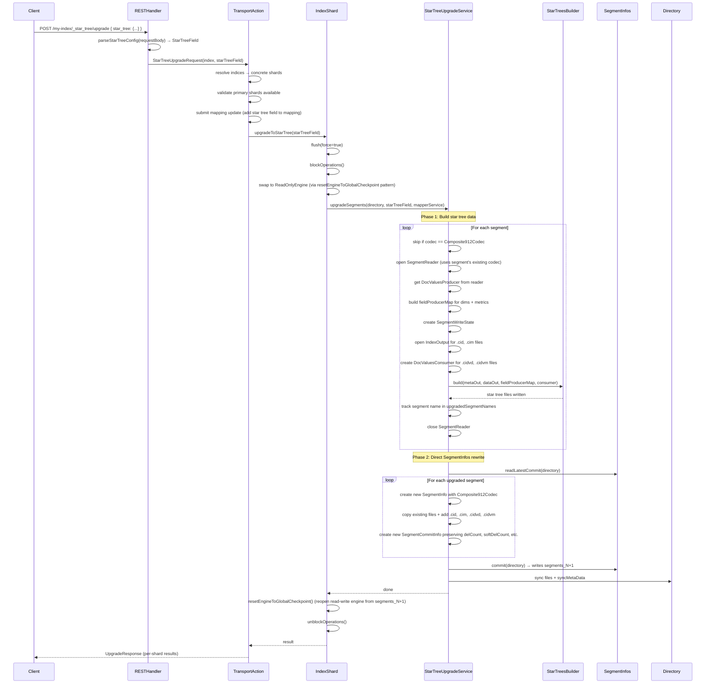
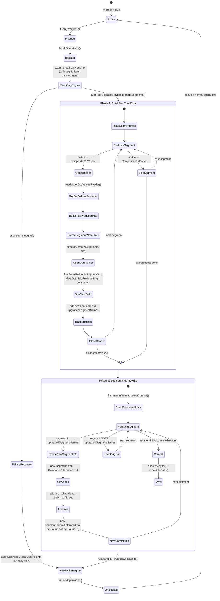

# Design Document: Retroactive Star Tree Building

## Overview

This feature adds the ability to retroactively upgrade existing OpenSearch index segments to use Star Tree indexes. The upgrade is a two-phase process:

1. **Star tree data generation**: Iterate over each segment, read its doc values via standard Lucene APIs, and build star tree data structures using the existing `StarTreesBuilder` infrastructure. The star tree files (`.cid`, `.cim`, `.cidvd`, `.cidvm`) are written directly to the directory via raw `IndexOutput` — no composite codec is needed for writing.
2. **Codec switch via direct SegmentInfos rewrite**: For each successfully upgraded segment, construct a new `SegmentCommitInfo` with `Composite912Codec` and the star tree files added to the file set. Commit the updated `SegmentInfos` as `segments_N+1`. This follows the same pattern as `Store.bootstrapNewHistory()` — direct `SegmentInfos` manipulation without `IndexWriter` or `IndexUpgrader`.

The upgrade is orchestrated at the shard level. The flow is: flush → blockOperations → swap to read-only engine → build star tree files → rewrite SegmentInfos → resetEngineToGlobalCheckpoint (reopen read-write engine) → unblockOperations. The read-write engine is swapped to a read-only engine during the upgrade — reads remain available from the last committed state, writes are blocked.

The star tree field configuration (dimensions, metrics) is provided in the API request body. However, `MapperService` is still required by `BaseStarTreeBuilder.generateMetricAggregatorInfos()` to resolve `FieldValueConverter` for each metric field. The mapping update (adding the star tree field to the index mapping) must happen before the per-shard upgrade so that `MapperService` has the composite field types available.

The feature is exposed through a new `TransportStarTreeUpgradeAction` that follows the `TransportBroadcastByNodeAction` pattern and routes upgrade requests to the nodes hosting the target shards.

### Why not IndexUpgrader?

`IndexUpgrader` opens an `IndexWriter` internally, which:
- Acquires a write lock on the directory, conflicting with the `ReadOnlyEngine`'s open readers
- Reads the committed `SegmentInfos` file set — it has no way to discover the star tree files written in Phase 1 (they're not in any committed file set yet)
- Upgrades ALL segments to the new codec, including segments that failed in Phase 1 (creating corrupt state)

### Why not force merge?

`forceMerge(1)` rewrites ALL segment data (stored fields, postings, norms, point values, doc values) into one new segment. For 1M docs with ~20 fields, the star tree build is ~20-30% of the total time — the other 70-80% is Lucene rewriting data that has nothing to do with the star tree.

### Why direct SegmentInfos rewrite?

- No `IndexWriter` needed — no write lock conflict with `ReadOnlyEngine`
- Full control over which segments get the codec switch (only successfully upgraded ones)
- Star tree files are explicitly added to each segment's file set
- Atomic commit — either `segments_N+1` is written or it isn't
- Same pattern already used by `Store.bootstrapNewHistory()` (line 907 of `Store.java`)

## Architecture




## Components and Interfaces

### 1. StarTreeUpgradeService 

A new class in `org.opensearch.index.compositeindex.datacube.startree` that encapsulates the two-phase upgrade logic. This keeps the upgrade logic separate from `IndexShard` and testable in isolation.

**Phase 1** builds star tree data files for each eligible segment using standard Lucene doc values APIs and raw `IndexOutput`. **Phase 2** directly rewrites `SegmentInfos` to switch the codec declaration and include star tree files in each segment's file set.

```java
package org.opensearch.index.compositeindex.datacube.startree;

public class StarTreeUpgradeService {

    /**
     * Upgrades all eligible segments in the given directory to use star tree indexes.
     *
     * Phase 1: Iterates segments, builds star tree files for those not already using Composite912Codec.
     *          Uses standard Lucene doc values APIs to read dimension/metric data.
     *          Writes .cid, .cim, .cidvd, .cidvm files via raw IndexOutput.
     * Phase 2: Rewrites SegmentInfos directly — creates new SegmentCommitInfo objects with
     *          Composite912Codec and star tree files in the file set, then commits segments_N+1.
     *
     * @param directory      the index directory
     * @param starTreeField  the star tree configuration parsed from the API request body
     * @param mapperService  needed by BaseStarTreeBuilder.generateMetricAggregatorInfos() to resolve FieldValueConverter
     * @return               the number of segments upgraded
     * @throws IOException   if an I/O error occurs during upgrade
     */
    public static int upgradeSegments(
        Directory directory,
        StarTreeField starTreeField,
        MapperService mapperService
    ) throws IOException;

    /**
     * Phase 1: Builds star tree files for a single segment.
     *
     * Opens a SegmentReader using the segment's existing codec (any codec works — we only
     * need doc values access). Gets DocValuesProducer from the reader. Builds fieldProducerMap
     * for all dimensions and metrics. Creates SegmentWriteState. Opens IndexOutput for .cid/.cim
     * and DocValuesConsumer for .cidvd/.cidvm. Calls StarTreesBuilder.build().
     *
     * Does NOT modify the segment's codec or .si file — that's Phase 2.
     */
    static void buildStarTreeData(
        Directory directory,
        SegmentCommitInfo commitInfo,
        StarTreeField starTreeField,
        MapperService mapperService
    ) throws IOException;

    /**
     * Phase 2: Rewrites SegmentInfos to switch upgraded segments to Composite912Codec.
     *
     * For each segment in upgradedSegmentNames:
     *   1. Create new SegmentInfo with Composite912Codec (copy all other fields from original)
     *   2. Add star tree files (.cid, .cim, .cidvd, .cidvm) to the file set
     *   3. Create new SegmentCommitInfo preserving delCount, softDelCount, delGen, etc.
     * Segments NOT in upgradedSegmentNames are kept unchanged.
     * Commits segments_N+1 atomically.
     *
     * Follows the same pattern as Store.bootstrapNewHistory() (Store.java line 907).
     */
    static void rewriteSegmentInfos(
        Directory directory,
        Set<String> upgradedSegmentNames
    ) throws IOException;
}
```

**Note on MapperService**: `MapperService` is required because `BaseStarTreeBuilder.generateMetricAggregatorInfos()` calls `mapperService.documentMapper().mappers().getMapper(metric.getField())` to resolve the `FieldValueConverter` for each metric field. This determines whether metrics are aggregated as `LONG`, `DOUBLE`, or `CompensatedSum`. The mapping update must happen before the per-shard upgrade so that `MapperService` has the star tree field types available.

**Note on star tree file writing**: Phase 1 does NOT use the composite codec pipeline. It reads doc values through standard Lucene APIs (`DocValuesProducer.getSortedNumeric()`, `getSortedSet()`) which work with any codec. It writes star tree files through raw `IndexOutput` and `LuceneDocValuesConsumerFactory`. The composite codec is only needed at read time — `Composite912DocValuesReader` reads the star tree structure from `.cim` metadata files.

### 2. IndexShard Extension

A new method `upgradeToStarTree(StarTreeField starTreeField)` on `IndexShard` that orchestrates the shard-level lifecycle. The engine swap follows the `resetEngineToGlobalCheckpoint()` pattern — creating a `ReadOnlyEngine` with proper `seqNoStats`, `translogStats`, and method overrides for `acquireLastIndexCommit()`, `acquireSafeIndexCommit()`, and `getSegmentInfosSnapshot()`.

```java
// In IndexShard.java
public int upgradeToStarTree(StarTreeField starTreeField) throws IOException, InterruptedException, TimeoutException {
    verifyActive();
    flush(new FlushRequest().force(true));

    final AtomicInteger upgradedCount = new AtomicInteger(0);
    indexShardOperationPermits.blockOperations(30, TimeUnit.MINUTES, () -> {
        // Swap to read-only engine following resetEngineToGlobalCheckpoint() pattern
        // — passes seqNoStats, translogStats, overrides acquireLastIndexCommit etc.
        final SeqNoStats seqNoStats = seqNoStats();
        final TranslogStats translogStats = translogStats();
        flush(new FlushRequest().waitIfOngoing(true));

        synchronized (engineMutex) {
            Engine currentEngine = currentEngineReference.get();
            ReadOnlyEngine readOnlyEngine = new ReadOnlyEngine(
                newEngineConfig(replicationTracker), seqNoStats, translogStats,
                false, Function.identity(), true
            );
            IOUtils.close(currentEngineReference.getAndSet(readOnlyEngine));
        }
        try {
            Directory dir = store().directory();
            int count = StarTreeUpgradeService.upgradeSegments(dir, starTreeField, mapperService);
            upgradedCount.set(count);
        } finally {
            // Reopen read-write engine from segments_N+1
            resetEngineToGlobalCheckpoint();
        }
    });
    return upgradedCount.get();
}
```

### 3. REST Handler and Request Parsing

A new REST handler that parses the star tree configuration from the request body into a `StarTreeField` object.

**API Endpoint**: `POST /{index}/_star_tree/upgrade`

**Request Body**:
```json
{
  "star_tree": {
    "name": "my_star_tree",
    "ordered_dimensions": [{ "name": "timestamp" }, { "name": "status" }],
    "metrics": [{ "name": "size", "stats": ["sum", "avg"] }]
  }
}
```

The REST handler parses this into a `StarTreeField` object and passes it to the transport action.

### 4. Transport Action

A new `TransportStarTreeUpgradeAction` that follows the `TransportBroadcastByNodeAction` pattern. The action:
1. Resolves target indices and validates primary shard availability
2. Submits a mapping update to add the star tree field to the index mapping (same bypass mechanism as the existing `star-tree-upgrade-via-mapping` spec — `allowCompositeFieldWithoutSettings` flag + `STAR_TREE_UPGRADE` merge reason)
3. Broadcasts `shardOperation()` to all nodes hosting target shards

```java
@Override
protected ShardUpgradeResult shardOperation(StarTreeUpgradeRequest request, ShardRouting shardRouting) throws IOException {
    IndexShard indexShard = indicesService.indexServiceSafe(shardRouting.shardId().getIndex())
        .getShard(shardRouting.shardId().id());
    StarTreeField starTreeField = request.getStarTreeField();
    int upgradedSegments = indexShard.upgradeToStarTree(starTreeField);
    return new ShardUpgradeResult(shardRouting.shardId(), shardRouting.primary(), upgradedSegments);
}
```

## Data Models

### Shard Upgrade Lifecycle




### Key Data Structures

**StarTreeField** (existing): Configuration object containing:
- `name`: Star tree field name
- `dimensionsOrder`: List of `Dimension` objects
- `metrics`: List of `Metric` objects
- `starTreeConfig`: `StarTreeFieldConfiguration` with build mode, max leaf docs, skip dimensions

**StarTreeUpgradeRequest**: Transport request containing:
- `indices`: Target index names
- `starTreeField`: The `StarTreeField` parsed from the API request body

**Codec switch via direct SegmentInfos rewrite**: For each upgraded segment, construct new Lucene objects:
```java
// Create new SegmentInfo with Composite912Codec
SegmentInfo newInfo = new SegmentInfo(
    oldInfo.dir, oldInfo.getVersion(), oldInfo.getMinVersion(),
    oldInfo.name, oldInfo.maxDoc(), oldInfo.getUseCompoundFile(),
    oldInfo.getHasBlocks(), new Composite912Codec(),
    oldInfo.getDiagnostics(), oldInfo.getId(),
    oldInfo.getAttributes(), oldInfo.getIndexSort()
);
// Add star tree files to file set
Set<String> files = new HashSet<>(oldInfo.files());
files.add(segName + ".cid");
files.add(segName + ".cim");
files.add(segName + ".cidvd");
files.add(segName + ".cidvm");
newInfo.setFiles(files);

// Preserve all commit metadata
SegmentCommitInfo newCommitInfo = new SegmentCommitInfo(
    newInfo, commitInfo.getDelCount(), commitInfo.getSoftDelCount(),
    commitInfo.getDelGen(), commitInfo.getFieldInfosGen(),
    commitInfo.getDocValuesGen(), commitInfo.getId()
);
```

This is atomic — `SegmentInfos.commit(directory)` writes `segments_N+1`. If it fails, the original `segments_N` remains intact. When `resetEngineToGlobalCheckpoint()` reopens the engine, it reads `segments_N+1` and uses `Composite912DocValuesReader` for the upgraded segments.

**SegmentCommitInfo preservation**: The new `SegmentCommitInfo` preserves all segment metadata (delCount, softDelCount, delGen, fieldInfosGen, docValuesGen, id) — only the codec declaration and file set change.

### File Artifacts Per Segment

For each upgraded segment `_X`, the following new files are created:
| File | Extension | Description |
|------|-----------|-------------|
| `_X.cid` | DATA_EXTENSION | Star tree index data |
| `_X.cim` | META_EXTENSION | Star tree index metadata |
| `_X.cidvd` | DATA_DOC_VALUES_EXTENSION | Star tree doc values data |
| `_X.cidvm` | META_DOC_VALUES_EXTENSION | Star tree doc values metadata |

## Correctness Properties

### Property 1: Upgrade idempotency

*For any* shard with a set of segments (some already using Composite912Codec, some not), running the star tree upgrade twice SHALL produce the same SegmentInfos state as running it once. Segments already using Composite912Codec are skipped in Phase 1, and Phase 2 only switches segments that were successfully upgraded.

**Validates: Requirements 2.1**

### Property 2: Upgraded segment codec and file set correctness

*For any* segment that does not already use Composite912Codec, after the star tree upgrade completes, the segment's SegmentInfo SHALL have its codec set to Composite912Codec, and its file set SHALL be a superset of the original file set (original files preserved, star tree files `.cid`, `.cim`, `.cidvd`, `.cidvm` added).

**Validates: Requirements 2.4, 2.5, 2.6**

### Property 3: Star tree config parsing round-trip

*For any* valid star tree configuration (with valid dimensions, metrics, and optional build parameters), serializing it to a request body and parsing it back SHALL produce an equivalent StarTreeField object.

**Validates: Requirements 3.1**

### Property 4: Invalid config rejection

*For any* request body that is missing required star tree fields (no dimensions, no metrics, or malformed structure), the parser SHALL reject it with a descriptive error and not proceed with the upgrade.

**Validates: Requirements 3.2**

### Property 5: Partial failure resilience

*For any* set of segments where some segments fail during star tree file generation in Phase 1, Phase 2 SHALL only switch the codec for segments in `upgradedSegmentNames` (the successfully upgraded ones). Failed segments SHALL retain their original codec and file set. The count of upgraded segments SHALL equal the count of eligible non-failing segments.

**Validates: Requirements 5.1**

### Property 6: Resource cleanup on all paths

*For any* upgrade attempt (successful or failed), all SegmentReader instances opened during the upgrade SHALL be closed after the upgrade completes. No file handles or readers SHALL be leaked.

**Validates: Requirements 5.4**

## Design Considerations

### 1. SegmentInfos Generation Number

`SegmentInfos.commit(directory)` internally calls `prepareCommit()` which auto-increments the generation number. However, `Store.commitSegmentInfos()` (line 907) does NOT call `changed()` before `commit()` — it relies on `commit()` handling the generation internally. The `changed()` method increments the version (not the generation) and is used by `NRTReplicationEngine` for segment replication versioning.

For our use case, we clone the `SegmentInfos`, modify it, and call `commit()`. The `commit()` method writes `segments_N+1` where N+1 is the next generation. No manual generation management is needed.

### 2. SegmentInfo Constructor Completeness

The `SegmentInfo` constructor takes all fields that define a segment's identity: dir, version, minVersion, name, maxDoc, useCompoundFile, hasBlocks, codec, diagnostics, id, attributes, indexSort. The `SegmentCommitInfo` wrapper adds the mutable state: delCount, softDelCount, delGen, fieldInfosGen, docValuesGen, id.

Implementation should include assertions to verify no state is lost:
```java
assert newInfo.maxDoc() == oldInfo.maxDoc();
assert newInfo.getVersion().equals(oldInfo.getVersion());
assert Arrays.equals(newInfo.getId(), oldInfo.getId());
assert Objects.equals(newInfo.getIndexSort(), oldInfo.getIndexSort());
assert newInfo.getAttributes().equals(oldInfo.getAttributes());
```

### 3. ReadOnlyEngine and SegmentInfos File Visibility

The `ReadOnlyEngine` holds a `DirectoryReader` that sees `segments_N`. Phase 2 writes `segments_N+1` to the same directory. The `ReadOnlyEngine` is unaffected — its reader is a snapshot of `segments_N`. Search queries during the upgrade return results from the pre-upgrade committed state. Star tree acceleration is only available after the upgrade completes and the read-write engine is reopened from `segments_N+1`.

This is correct and expected behavior — the read-only engine provides consistent reads during the upgrade window.

### 4. Mapping Update Ordering — Cluster State Propagation

The mapping update in `TransportStarTreeUpgradeAction.doExecute()` is submitted as a cluster state update and waits for acknowledgment from all nodes before broadcasting `shardOperation()`. However, cluster state acknowledgment means the master received acks, not that all nodes have applied the state.

Since this is a new star tree being added to an index that never had one, `MapperService` will have zero composite field types until the cluster state propagates. `shardOperation()` must verify that `MapperService` has the star tree field before proceeding:
```java
@Override
protected ShardUpgradeResult shardOperation(StarTreeUpgradeRequest request, ShardRouting shardRouting) {
    IndexShard indexShard = ...;
    // Verify mapping is available on this node — this index never had star tree before,
    // so composite field types will be empty until cluster state propagates
    if (indexShard.mapperService().getCompositeFieldTypes().isEmpty()) {
        throw new IllegalStateException(
            "Star tree field not yet available in MapperService. Cluster state may not have propagated. Retry."
        );
    }
    int upgradedSegments = indexShard.upgradeToStarTree(request.getStarTreeField());
    return new ShardUpgradeResult(...);
}
```

### 5. Double Flush Rationale

The `upgradeToStarTree()` method flushes twice:
```java
// Flush 1: Before blocking — reduces work needed after blocking
flush(new FlushRequest().force(true));

indexShardOperationPermits.blockOperations(30, TimeUnit.MINUTES, () -> {
    // Flush 2: After blocking — catches any writes that arrived between flush 1 and block
    flush(new FlushRequest().waitIfOngoing(true));
    // ... engine swap and upgrade ...
});
```

Flush 1 reduces the amount of data that needs to be flushed after blocking (minimizes the time operations are blocked). Flush 2 ensures all data is committed before the engine swap — any writes that arrived between flush 1 and `blockOperations()` are captured.

## Error Handling

### Segment-Level Errors (Phase 1)

When star tree file generation fails for a single segment:
1. The `SegmentReader` for that segment is closed in a `finally` block
2. The error is logged with the segment name and exception details
3. The segment name is NOT added to `upgradedSegmentNames`
4. Processing continues with the next segment
5. Orphaned star tree files for the failed segment are harmless — they'll be cleaned up on the next merge or segment deletion since they're not in any committed file set

### Commit-Level Errors (Phase 2 — SegmentInfos rewrite)

When `SegmentInfos.commit(directory)` fails:
1. The original `segments_N` remains the committed state (atomic commit semantics)
2. The exception propagates up to `IndexShard.upgradeToStarTree()`
3. The engine reopen in the `finally` block (`resetEngineToGlobalCheckpoint()`) opens from the original `segments_N`
4. Star tree data files written in Phase 1 become orphaned but harmless

### Engine Reopen Errors

When `resetEngineToGlobalCheckpoint()` fails after the upgrade:
1. The exception is logged at ERROR level
2. The exception propagates to the caller
3. The shard may need manual recovery (similar to other engine failure scenarios)
4. The operation permits are still released (via the `blockOperations` callback completing)

### Configuration Errors

When the API request body does not contain a valid star tree field configuration:
1. The REST handler or transport action rejects the request before any shard processing begins
2. An `IllegalArgumentException` is thrown with a descriptive message
3. No segment processing or engine lifecycle changes occur

### Error Response Structure

The upgrade response per shard includes:
- `shardId`: The shard that was upgraded
- `upgradedSegments`: Count of successfully upgraded segments
- `skippedSegments`: Count of segments already using Composite912Codec
- `failedSegments`: Count of segments that failed during Phase 1
- `error`: Exception details if the entire shard upgrade failed

## Testing Strategy

### Unit Tests

1. **Codec detection**: Test that `upgradeSegments` correctly identifies segments using Composite912Codec vs other codecs and skips them
2. **Star tree config parsing**: Test that valid request bodies produce correct `StarTreeField` objects, and invalid bodies are rejected
3. **SegmentInfo construction**: Test that the new SegmentInfo has Composite912Codec, correct file set (superset of original + star tree files), and preserved attributes
4. **SegmentCommitInfo preservation**: Test that delCount, softDelCount, delGen, fieldInfosGen, docValuesGen are preserved through the SegmentInfos rewrite
5. **Partial failure**: Test that only successfully upgraded segments get the codec switch; failed segments retain original codec

### Integration Tests

1. **Full upgrade flow**: Index documents → upgrade via API → verify star tree data files exist and segments declare Composite912Codec
2. **Operation blocking during upgrade**: Start upgrade → verify writes blocked, reads continue from read-only engine
3. **Post-upgrade operation resumption**: Complete upgrade → verify reads and writes succeed
4. **Idempotent upgrade**: Upgrade → upgrade again → verify no changes on second run
5. **Mixed codec segments**: Some segments already Composite912 → upgrade → verify only non-Composite912 upgraded
6. **Concurrent upgrade rejection**: Start two upgrades on same shard → verify second is rejected
7. **Invalid config rejection**: Send upgrade request with missing/invalid star tree config → verify error response
8. **Star tree query routing**: After upgrade, verify aggregation queries use star tree path (requires mapping update)

### Property-Based Tests

Property-based tests use a PBT library (e.g., jqwik for Java) with minimum 100 iterations per property.

- **Property 1 (Idempotency)**: Generate random segment sets with mixed codecs, run upgrade twice, assert SegmentInfos are identical after both runs
  - Tag: **Feature: retroactive-star-tree-building, Property 1: Upgrade idempotency**
- **Property 2 (Codec and file set)**: Generate random non-Composite912 segments, upgrade, assert codec is Composite912 and files are superset
  - Tag: **Feature: retroactive-star-tree-building, Property 2: Upgraded segment codec and file set correctness**
- **Property 3 (Config parsing round-trip)**: Generate random valid StarTreeField configs, serialize to request body, parse back, assert equivalence
  - Tag: **Feature: retroactive-star-tree-building, Property 3: Star tree config parsing round-trip**
- **Property 4 (Invalid config rejection)**: Generate random invalid request bodies, assert rejection with error
  - Tag: **Feature: retroactive-star-tree-building, Property 4: Invalid config rejection**
- **Property 5 (Partial failure)**: Generate random segment sets, inject failures on random subset, assert only non-failing segments get codec switch
  - Tag: **Feature: retroactive-star-tree-building, Property 5: Partial failure resilience**
- **Property 6 (Resource cleanup)**: Generate random segment sets (with and without injected failures), assert all readers are closed
  - Tag: **Feature: retroactive-star-tree-building, Property 6: Resource cleanup on all paths**
