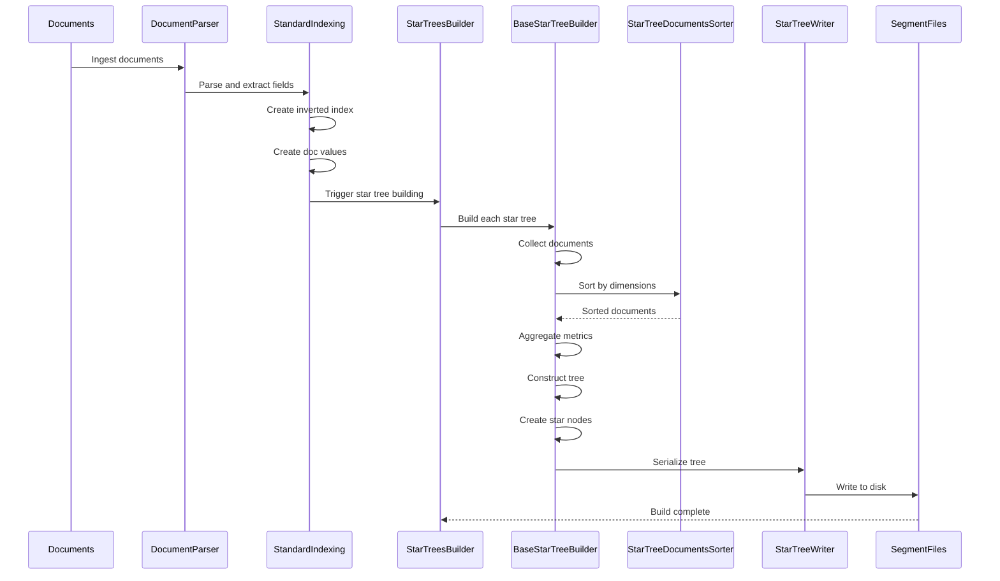
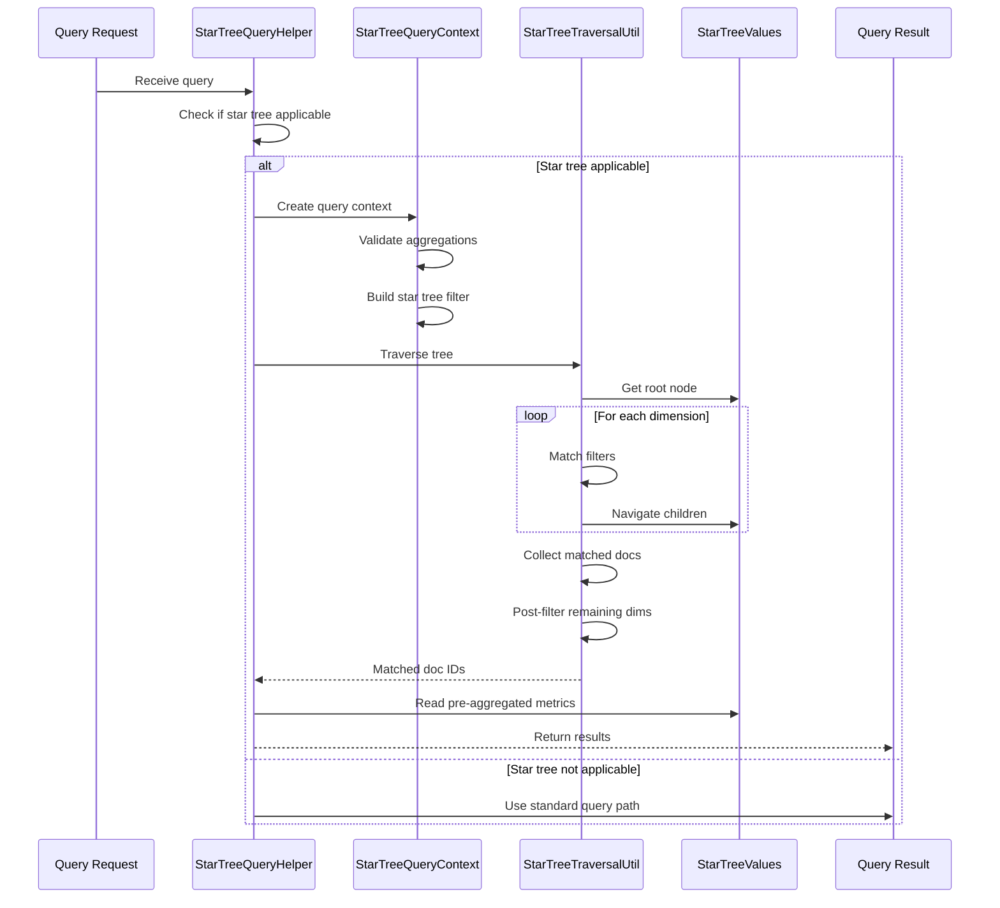
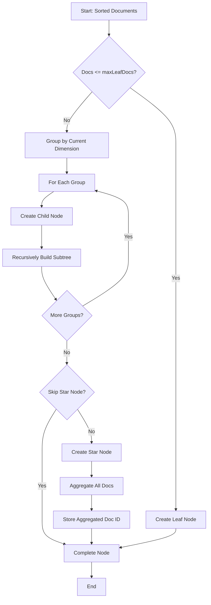
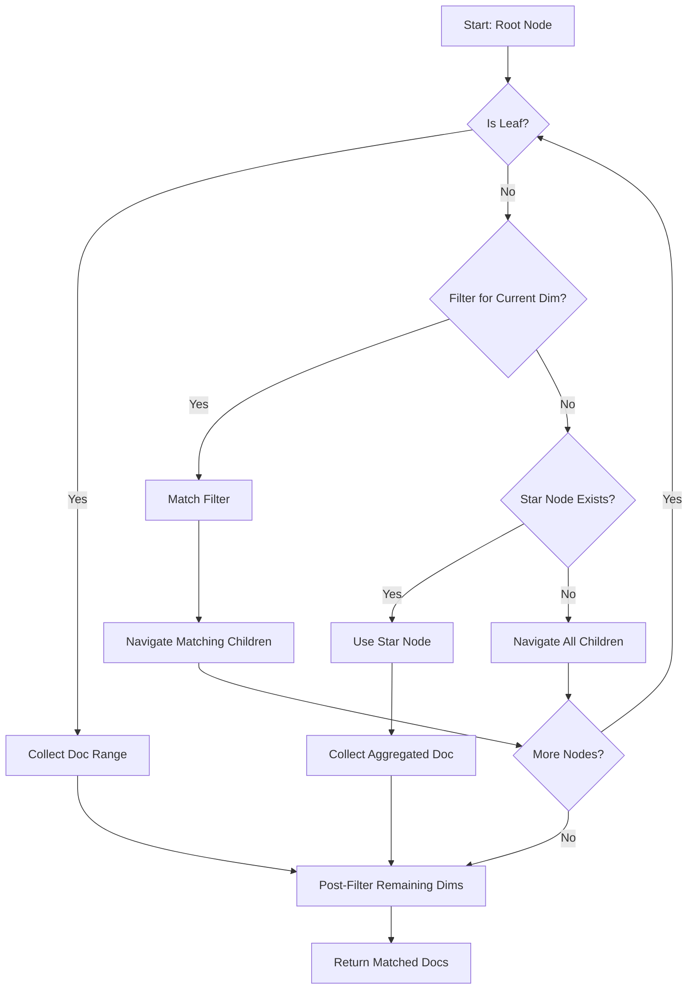

# Design Document: Star Tree Documentation

## Overview

This design document outlines the structure and content for comprehensive documentation of the OpenSearch Star Tree feature. The documentation will serve as a technical reference that explains how the existing star tree implementation works, covering the complete flow from index creation through query execution.

The documentation is organized into logical sections that follow the natural flow of star tree operations: configuration and mapping, building process, storage layer, query execution, and supporting utilities. Each section will provide detailed explanations, code examples, diagrams, and cross-references to help developers understand the implementation.

## Architecture

### Documentation Structure

The documentation will be organized as a single comprehensive markdown document with the following major sections:

1. **Introduction and Overview** - High-level explanation of star tree purpose and architecture
2. **Configuration and Mapping** - How star trees are defined and configured
3. **Building Process** - How star trees are constructed during indexing
4. **Storage Layer** - How star tree data is persisted to disk
5. **Query Execution** - How queries utilize star trees for optimization
6. **Utilities and Supporting Components** - Helper classes and utilities
7. **Data Flow and Integration** - End-to-end flow diagrams and integration points
8. **Code Organization** - Package structure and navigation guide
9. **Key Algorithms** - Core algorithms with detailed explanations
10. **Configuration Examples** - Practical examples and patterns
11. **Performance Characteristics** - Performance analysis and tuning guidance

### Documentation Approach

The documentation will follow these principles:

- **Code-First**: Reference actual implementation classes and methods
- **Example-Driven**: Include concrete code examples from the codebase
- **Visual**: Use Mermaid diagrams for flows and relationships
- **Cross-Referenced**: Link related sections and components
- **Practical**: Include configuration examples and common patterns
- **Complete**: Cover all major components and their interactions

## Components and Interfaces

### Section 1: Configuration and Mapping

This section documents how star trees are configured through the mapping API.

**Key Components to Document:**

1. **StarTreeMapper** (`org.opensearch.index.mapper.StarTreeMapper`)
   - Purpose: Integrates star tree with OpenSearch mapping system
   - Key responsibilities:
     - Parse star tree configuration from index mappings
     - Validate dimension and metric definitions
     - Create StarTreeFieldType
     - Handle mapping merges
   - Configuration parsing flow
   - Validation rules and constraints

2. **StarTreeFieldConfiguration** (`org.opensearch.index.compositeindex.datacube.startree.StarTreeFieldConfiguration`)
   - Purpose: Stores build-time parameters
   - Key parameters:
     - `maxLeafDocs`: Controls tree depth vs leaf size
     - `skipStarNodeCreationInDims`: Optimize for high-cardinality dimensions
     - `buildMode`: ON_HEAP vs OFF_HEAP memory management
   - Parameter effects on build and query performance

3. **StarTreeField** (`org.opensearch.index.compositeindex.datacube.startree.StarTreeField`)
   - Purpose: Represents complete star tree configuration
   - Structure:
     - Dimensions order (critical for tree structure)
     - Metrics with aggregation types
     - Configuration parameters
   - Dimension and metric validation

4. **StarTreeIndexSettings** (`org.opensearch.index.compositeindex.datacube.startree.StarTreeIndexSettings`)
   - Purpose: Index-level settings for star tree
   - Settings:
     - Maximum dimensions allowed
     - Maximum metrics allowed
     - Default values
   - How settings affect validation

**Content Structure:**
- Overview of mapping integration
- Configuration parameter reference
- Dimension types and constraints
- Metric types and aggregation stats
- Validation rules
- Configuration examples (basic and advanced)
- Common configuration patterns

### Section 2: Building Process

This section documents how star trees are constructed during indexing.

**Key Components to Document:**

1. **BaseStarTreeBuilder** (`org.opensearch.index.compositeindex.datacube.startree.builder.BaseStarTreeBuilder`)
   - Purpose: Core building logic (abstract base class)
   - Build phases:
     - Document collection from segment
     - Sorting by dimension order
     - Aggregation of metrics
     - Tree construction with star nodes
     - Serialization to disk
   - Memory management strategies
   - Build algorithm details

2. **OnHeapStarTreeBuilder** (`org.opensearch.index.compositeindex.datacube.startree.builder.OnHeapStarTreeBuilder`)
   - Purpose: In-memory implementation
   - When to use: Smaller datasets
   - Memory characteristics
   - Performance trade-offs

3. **OffHeapStarTreeBuilder** (`org.opensearch.index.compositeindex.datacube.startree.builder.OffHeapStarTreeBuilder`)
   - Purpose: Off-heap implementation (default)
   - When to use: Large datasets
   - Memory management benefits
   - Performance characteristics

4. **StarTreesBuilder** (`org.opensearch.index.compositeindex.datacube.startree.builder.StarTreesBuilder`)
   - Purpose: Orchestrates building multiple star trees
   - Coordination logic
   - Resource management
   - Integration with segment creation

5. **StarTreeDocsFileManager** (`org.opensearch.index.compositeindex.datacube.startree.builder.StarTreeDocsFileManager`)
   - Purpose: Manages temporary document storage during building
   - File management strategy
   - Document iteration
   - Cleanup process

6. **StarTreeDocumentsSorter** (`org.opensearch.index.compositeindex.datacube.startree.utils.StarTreeDocumentsSorter`)
   - Purpose: Sorts documents by dimension order
   - Sorting algorithm
   - Multi-dimensional sorting strategy
   - Performance characteristics

**Content Structure:**
- Build lifecycle overview
- Phase-by-phase explanation
- Tree construction algorithm
- Star node creation logic
- Aggregation process
- Memory management strategies
- Integration with indexing pipeline
- Build performance characteristics

### Section 3: Storage Layer

This section documents how star tree data is persisted to disk.

**Key Components to Document:**

1. **Composite912Codec** (`org.opensearch.index.codec.composite.composite912.Composite912Codec`)
   - Purpose: Integrates star tree with Lucene codec system
   - Codec architecture
   - How star tree extends standard codec
   - File format integration

2. **Composite912DocValuesFormat** (`org.opensearch.index.codec.composite.composite912.Composite912DocValuesFormat`)
   - Purpose: DocValues format for star tree data
   - DocValues integration
   - Format structure
   - Read/write operations

3. **StarTreeWriter** (`org.opensearch.index.compositeindex.datacube.startree.fileformats.StarTreeWriter`)
   - Purpose: Writes star tree to disk
   - Writing process
   - File organization
   - Serialization format

4. **StarTreeMetadata** (`org.opensearch.index.compositeindex.datacube.startree.fileformats.meta.StarTreeMetadata`)
   - Purpose: Metadata about star tree structure
   - Metadata contents:
     - Field name
     - Dimension count and names
     - Metric count and names
     - Configuration parameters
     - Node count
     - Document count
   - Serialization format

5. **FixedLengthStarTreeNode** (`org.opensearch.index.compositeindex.datacube.startree.fileformats.node.FixedLengthStarTreeNode`)
   - Purpose: Serialized node format
   - Node structure:
     - Dimension ID
     - Dimension value
     - Child pointers
     - Aggregated doc ID
     - Leaf node ranges
   - Fixed-length encoding benefits

**Content Structure:**
- Storage architecture overview
- File format specification
- Metadata format
- Tree structure format
- DocValues format for dimensions and metrics
- Compression and encoding strategies
- Read/write operations
- File organization within segments

### Section 4: Query Execution

This section documents how queries utilize star trees for optimization.

**Key Components to Document:**

1. **StarTreeQueryHelper** (`org.opensearch.search.startree.StarTreeQueryHelper`)
   - Purpose: Query coordination and optimization
   - Key responsibilities:
     - Determine if query can use star tree
     - Extract filters and aggregations
     - Coordinate result collection
     - Manage caching
   - Query eligibility criteria
   - Helper methods for dimension matching

2. **StarTreeQueryContext** (`org.opensearch.search.startree.StarTreeQueryContext`)
   - Purpose: Query context management
   - Context contents:
     - Composite field type
     - Base query builder
     - Star tree filter
     - Per-segment cache
   - Context lifecycle
   - Filter consolidation process
   - Validation logic for aggregations

3. **StarTreeTraversalUtil** (`org.opensearch.search.startree.StarTreeTraversalUtil`)
   - Purpose: Tree traversal logic
   - Traversal algorithm:
     - Breadth-first search
     - Filter matching at each level
     - Star node utilization
     - Remaining dimension handling
   - Result collection
   - Post-filtering process

4. **StarTreeFilter** (`org.opensearch.search.startree.filter.StarTreeFilter`)
   - Purpose: Represents dimension filters for query
   - Filter structure:
     - Map of dimension name to filters
     - Multiple filters per dimension (OR logic)
   - Filter types:
     - ExactMatchDimFilter
     - RangeMatchDimFilter
     - MatchAllFilter
     - MatchNoneFilter
   - Filter merging logic

5. **StarTreeValues** (`org.opensearch.index.compositeindex.datacube.startree.index.StarTreeValues`)
   - Purpose: Runtime access to star tree data
   - Data access methods:
     - Get root node
     - Get dimension iterators
     - Get metric iterators
     - Get star tree field
   - Iterator types and usage

**Content Structure:**
- Query execution overview
- Query eligibility determination
- Filter construction from query
- Tree traversal algorithm
- Node matching logic
- Result collection process
- Post-filtering for unmatched dimensions
- Caching strategy
- Integration with aggregation framework

### Section 5: Utilities and Supporting Components

This section documents helper classes and utilities.

**Key Components to Document:**

1. **StarTreeUtils** (`org.opensearch.index.compositeindex.datacube.startree.utils.StarTreeUtils`)
   - Purpose: Common utility functions
   - Key utilities:
     - Field name construction
     - Value conversions
     - Helper methods

2. **Aggregators** (`org.opensearch.index.compositeindex.datacube.startree.aggregators.*`)
   - Purpose: Metric aggregation implementations
   - Aggregator types:
     - SumValueAggregator
     - CountValueAggregator
     - MinValueAggregator
     - MaxValueAggregator
     - DocCountAggregator
   - ValueAggregatorFactory
   - Aggregation algorithm for each type

3. **Iterators** (`org.opensearch.index.compositeindex.datacube.startree.utils.iterator.*`)
   - Purpose: Iterate over star tree values
   - Iterator types:
     - SortedNumericStarTreeValuesIterator
     - SortedSetStarTreeValuesIterator
   - Usage patterns

4. **Date/Time Utilities** (`org.opensearch.index.compositeindex.datacube.startree.utils.date.*`)
   - Purpose: Date dimension handling
   - DateTimeUnitAdapter
   - DateTimeUnitRounding
   - Interval matching logic

5. **StarTreeValidator** (`org.opensearch.index.compositeindex.datacube.startree.StarTreeValidator`)
   - Purpose: Validation logic
   - Validation rules
   - When validation occurs
   - Error handling

**Content Structure:**
- Utility overview
- Aggregator implementations
- Iterator usage patterns
- Date/time handling
- Validation rules
- Helper method reference

## Data Models

### StarTreeDocument

Represents a document in the star tree (original or aggregated):

```java
class StarTreeDocument {
    Long[] dimensions;    // Dimension values (null = star node)
    Object[] metrics;     // Aggregated metric values
}
```

**Key Characteristics:**
- `null` in dimensions array indicates a star node (wildcard)
- Metrics are pre-aggregated values
- Used during building and querying

### StarTreeNode (In-Memory)

Tree node structure during building:

```java
class InMemoryTreeNode {
    int dimensionId;           // Which dimension this node represents
    long dimensionValue;       // Value for this dimension
    int startDocId;            // Start of doc range (for leaf)
    int endDocId;              // End of doc range (for leaf)
    int aggregatedDocId;       // ID of aggregated document
    StarTreeNodeType nodeType; // STAR, DEFAULT, or NULL
    Map<Long, InMemoryTreeNode> children;  // Child nodes
}
```

**Key Characteristics:**
- Hierarchical structure
- Star nodes have special type
- Leaf nodes have document ranges
- Non-leaf nodes have children map

### StarTreeNode (Serialized)

Fixed-length node format on disk:

```java
class FixedLengthStarTreeNode {
    int dimensionId;
    long dimensionValue;
    int startDocId;
    int endDocId;
    int aggregatedDocId;
    byte nodeType;
    long firstChildId;
    long lastChildId;
}
```

**Key Characteristics:**
- Fixed-length encoding for efficient storage
- Child pointers instead of map
- Compact representation

### StarTreeFilter

Query filter structure:

```java
class StarTreeFilter {
    Map<String, List<DimensionFilter>> dimensions;
}
```

**Key Characteristics:**
- Maps dimension names to filters
- Multiple filters per dimension (OR logic)
- Used during tree traversal

## Data Flow Diagrams

### Index-Time Flow



### Query-Time Flow



### Tree Construction Algorithm



### Tree Traversal Algorithm



## Error Handling

### Configuration Errors

**Validation Failures:**
- Invalid dimension types
- Duplicate dimensions
- Too many dimensions/metrics
- Invalid maxLeafDocs value
- Skip star node for non-existent dimension

**Handling:**
- Throw IllegalArgumentException with descriptive message
- Fail at mapping creation time
- Prevent index creation with invalid configuration

### Build Errors

**Build Failures:**
- Out of memory during building
- Disk space exhaustion
- Corrupted segment data
- Invalid document values

**Handling:**
- Fail segment creation
- Log detailed error information
- Clean up partial builds
- Retry with different build mode if applicable

### Query Errors

**Query Failures:**
- Star tree data corruption
- Missing star tree files
- Invalid filter construction
- Aggregation validation failure

**Handling:**
- Fall back to standard query path
- Log warning about star tree unavailability
- Return correct results using standard aggregation
- Don't fail the query

## Testing Strategy

This is a documentation project, so testing focuses on documentation quality and completeness rather than code testing.

### Documentation Validation

**Completeness Checks:**
- All requirements have corresponding documentation sections
- All key classes are documented
- All major flows are explained
- All configuration parameters are documented

**Accuracy Checks:**
- Code examples compile and run
- Class names and method signatures are correct
- File paths are accurate
- Configuration examples are valid

**Clarity Checks:**
- Technical terms are defined in glossary
- Diagrams accurately represent flows
- Examples are clear and well-explained
- Cross-references are correct

### Review Process

**Technical Review:**
- Review by star tree implementation team
- Verify technical accuracy
- Check for missing components
- Validate algorithm explanations

**User Review:**
- Review by potential documentation users
- Check for clarity and understandability
- Identify confusing sections
- Suggest improvements

**Completeness Review:**
- Map requirements to documentation sections
- Verify all acceptance criteria are met
- Check for gaps in coverage
- Ensure all integration points are documented


## Correctness Properties

A property is a characteristic or behavior that should hold true across all valid executions of a system—essentially, a formal statement about what the system should do. Properties serve as the bridge between human-readable specifications and machine-verifiable correctness guarantees.

### Documentation Quality Properties

Since this is a documentation project, the correctness properties focus on documentation quality, completeness, and accuracy rather than code behavior. All acceptance criteria in the requirements document relate to documentation content, which requires human review rather than automated property-based testing.

**Key Observation:** All 70 acceptance criteria across the 10 requirements are documentation content requirements. They specify what information must be present in the documentation, how it should be explained, and what examples should be included. These are inherently qualitative requirements that cannot be validated through property-based testing.

### Documentation Validation Approach

Instead of property-based tests, documentation quality will be validated through:

1. **Completeness Review**
   - Verify all required components are documented
   - Check that all classes mentioned in requirements are covered
   - Ensure all configuration parameters are explained
   - Confirm all flows have diagrams

2. **Accuracy Review**
   - Verify class names and paths are correct
   - Check that code examples are valid
   - Ensure technical explanations match implementation
   - Validate configuration examples work

3. **Clarity Review**
   - Assess readability and understandability
   - Check that technical terms are defined
   - Verify examples are clear and well-explained
   - Ensure cross-references are correct

4. **Coverage Review**
   - Map each requirement to documentation sections
   - Verify all acceptance criteria are addressed
   - Check for gaps in coverage
   - Ensure integration points are explained

### Manual Validation Checklist

The following checklist will be used to validate the documentation against requirements:

**Requirement 1: Configuration and Mapping**
- [ ] StarTreeMapper integration explained
- [ ] StarTreeFieldConfiguration documented with all parameters
- [ ] StarTreeIndexSettings documented
- [ ] Valid configuration examples provided
- [ ] Dimension/metric relationship explained
- [ ] Dimension ordering documented
- [ ] Validation rules documented

**Requirement 2: Building Process**
- [ ] Complete build lifecycle explained
- [ ] BaseStarTreeBuilder role described
- [ ] OnHeap vs OffHeap differences documented
- [ ] StarTreesBuilder orchestration explained
- [ ] Document sorting process described
- [ ] StarTreeDocsFileManager documented
- [ ] Aggregation process explained
- [ ] Star node creation logic described
- [ ] Tree construction algorithm documented
- [ ] Memory management strategies explained

**Requirement 3: Storage Layer**
- [ ] Composite912Codec integration explained
- [ ] Composite912DocValuesFormat role described
- [ ] File format documented
- [ ] Metadata format explained
- [ ] DocValues storage described
- [ ] Node serialization format documented
- [ ] Compression strategies explained
- [ ] File organization described

**Requirement 4: Query Execution**
- [ ] StarTreeQueryHelper role explained
- [ ] StarTreeQueryContext structure described
- [ ] Query analysis process documented
- [ ] Filter construction explained
- [ ] StarTreeFilter structure described
- [ ] Traversal algorithm documented
- [ ] Node matching logic explained
- [ ] Result collection described
- [ ] Post-filtering process documented
- [ ] Optimization decisions explained

**Requirement 5: Utilities**
- [ ] StarTreeUtils purpose explained
- [ ] StarTreeDocumentsSorter described
- [ ] StarTreeValidator documented
- [ ] Date/time utilities explained
- [ ] Iterator implementations described
- [ ] Aggregator implementations documented
- [ ] ValueAggregatorFactory explained

**Requirement 6: Data Flow**
- [ ] Index-time flow diagram provided
- [ ] Query-time flow diagram provided
- [ ] Indexing pipeline integration explained
- [ ] Aggregation framework integration described
- [ ] Segment merging interaction documented
- [ ] DocValues relationship explained
- [ ] Error handling described

**Requirement 7: Code Organization**
- [ ] Package structure overview provided
- [ ] Package purposes described
- [ ] Key classes documented
- [ ] Naming conventions explained
- [ ] Class relationships described
- [ ] Navigation guidance provided

**Requirement 8: Algorithms**
- [ ] Tree construction algorithm documented
- [ ] Tree traversal algorithm explained
- [ ] StarTreeDocument structure described
- [ ] StarTreeNode structure documented
- [ ] Aggregation algorithms explained
- [ ] Sorting algorithms described
- [ ] Key data structures documented

**Requirement 9: Examples**
- [ ] Basic configuration example provided
- [ ] Advanced configuration example provided
- [ ] Dimension ordering examples shown
- [ ] Skip star node examples demonstrated
- [ ] Date dimension examples provided
- [ ] Metric aggregation examples shown
- [ ] Invalid configuration examples included

**Requirement 10: Performance**
- [ ] Build time complexity described
- [ ] Space complexity described
- [ ] Query performance characteristics explained
- [ ] Memory usage documented
- [ ] Performance factors described
- [ ] Trade-offs explained
- [ ] Tuning guidance provided

### No Automated Properties

After analyzing all 70 acceptance criteria, none are suitable for property-based testing because:

1. **Content Requirements**: All criteria specify what content must be present in documentation
2. **Qualitative Nature**: Requirements involve explanations, descriptions, and examples
3. **Human Judgment**: Assessing whether documentation "explains" or "describes" something requires human understanding
4. **No Computational Properties**: There are no universal rules that can be tested across generated inputs

This is expected and appropriate for a documentation project. The validation will rely on thorough human review using the checklist above.
