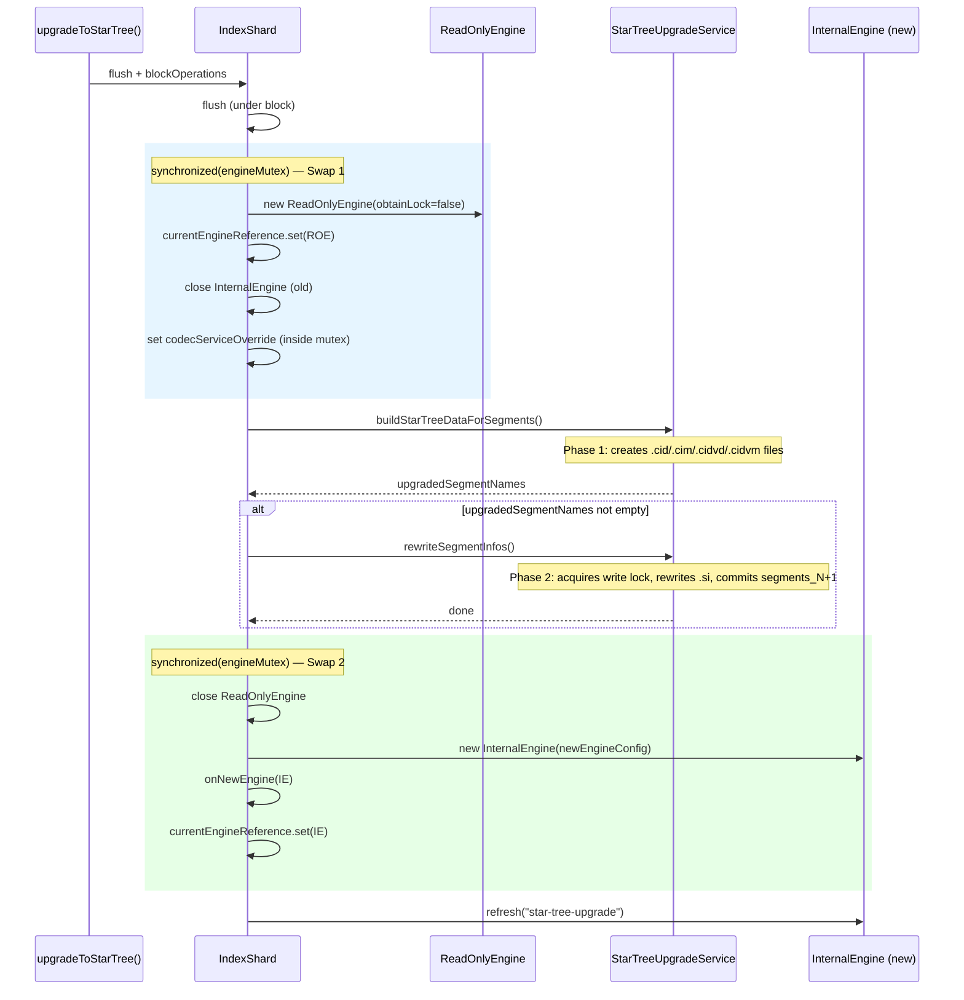

# Design Document: Star Tree Upgrade Read Availability

## Overview

This design addresses the read unavailability window during per-segment star tree upgrades in OpenSearch. The current `IndexShard.upgradeToStarTree()` implementation closes the `InternalEngine` entirely — setting `currentEngineReference` to `null` — while star tree data is built and SegmentInfos are rewritten. This creates a window (27+ seconds for large indices) where all search/read operations fail because `getEngineOrNull()` returns `null`.

The solution introduces a **ReadOnlyEngine bridge pattern**: instead of nulling the engine reference, the upgrade atomically swaps from `InternalEngine` → `ReadOnlyEngine` (with `obtainLock=false`), performs the two-phase upgrade against the directory, then atomically swaps from `ReadOnlyEngine` → new `InternalEngine`. The `ReadOnlyEngine` serves reads from a snapshot of the pre-upgrade `SegmentInfos` throughout both phases.

Three additional correctness fixes are included:
1. **codecServiceOverride lifecycle** — the override is kept set after the upgrade (not cleared to `null`) so that `resetEngineToGlobalCheckpoint()` and other engine-only restarts use the composite codec. It is nulled after the first post-upgrade engine reset confirms the persistent `index.composite_index=true` setting took effect, avoiding a permanent volatile read overhead.
2. **StarTreeUpgradeService method split** — `upgradeSegments()` is split into `buildStarTreeDataForSegments()` and `rewriteSegmentInfos()` to allow engine lifecycle operations between phases. `buildStarTreeDataForSegments()` also tracks all candidate segments (not just successful ones) so cleanup on failure targets the right files.
3. **index.composite_index in cluster state** — `applyStarTreeMapping()` sets `index.composite_index=true` alongside `append_only=true` so the metadata is truthful and subsequent `CodecService` instances include `Composite912Codec`.

### Platform Notes

- **Windows compatibility**: The `.si` file deletion in Phase 2 is safe because `ReadOnlyEngine`'s `DirectoryReader` does not hold open file descriptors to `.si` files (they are read and closed during `SegmentInfos` construction). However, Windows behavior with `NIOFSDirectory` and `CompoundDirectory` file handles has not been fully verified. The initial implementation targets Linux/macOS where POSIX semantics guarantee safe file deletion while FDs are open. Windows should be tested before claiming cross-platform safety.
- **Checked exception propagation**: `blockOperations()` accepts `CheckedRunnable<Exception>`, so `IOException`, `InterruptedException`, and `TimeoutException` thrown inside the lambda propagate unwrapped to `upgradeToStarTree()`'s caller. A future refactor of `blockOperations`' signature could change this wrapping behavior.

## Architecture

The upgrade flow changes from a linear close-upgrade-reopen pattern to a bridged pattern with two atomic swap points:



### Key Design Decisions

1. **ReadOnlyEngine with `obtainLock=false`**: The `ReadOnlyEngine` constructor accepts an `obtainLock` parameter. Passing `false` skips acquiring `IndexWriter.WRITE_LOCK_NAME`, which is necessary because Phase 2 needs to acquire the write lock to rewrite `.si` files and commit `segments_N+1`. The `ReadOnlyEngine` holds a `DirectoryReader` snapshot of `segments_N` that is unaffected by the new commit.

2. **codecServiceOverride lifecycle**: The current code clears `codecServiceOverride = null` after the engine restart. This is incorrect because `resetEngineToGlobalCheckpoint()` calls `newEngineConfig()` which falls back to the stale `codecService` (a `final` field created before the mapping update). The override is set inside the Swap 1 `synchronized(engineMutex)` block — after the old engine is closed but before any other code can call `newEngineConfig()`. This prevents a race where a concurrent operation sees the override while the old engine is still active. The override is kept set after the upgrade and nulled only after the first post-upgrade engine reset confirms the persistent `index.composite_index=true` setting took effect (i.e., `mapperService.isCompositeIndexPresent()` returns true and the fresh `codecService` already includes `Composite912Codec`). This avoids a permanent volatile read overhead on every `newEngineConfig()` call.

3. **Phase 2 write lock acquisition**: `rewriteSegmentInfos()` acquires `IndexWriter.WRITE_LOCK_NAME` before deleting old `.si` files and writing new ones. This is a defensive measure — no other writer should be active, but the lock prevents concurrent modification. The `ReadOnlyEngine` (opened with `obtainLock=false`) is unaffected.

4. **index.composite_index in cluster state**: Setting this in `applyStarTreeMapping()` makes the metadata truthful. When the `IndexShard` is later reconstructed (e.g., shard relocation, node restart), the `CodecService` constructor sees `mapperService.isCompositeIndexPresent() == true` and includes `Composite912Codec` without needing the override.

## Components and Interfaces

### IndexShard.upgradeToStarTree() — Rewritten

The method is restructured into distinct phases with two atomic swap points:

```java
public int upgradeToStarTree(StarTreeField starTreeField) throws IOException, InterruptedException, TimeoutException {
    verifyActive();
    if (starTreeUpgradeInProgress.compareAndSet(false, true) == false) {
        throw new IllegalStateException("star tree upgrade already in progress");
    }
    try {
        flush(new FlushRequest().force(true));
        indexShardOperationPermits.blockOperations(30, TimeUnit.MINUTES, () -> {
            // blockOperations accepts CheckedRunnable<Exception> — IOException,
            // InterruptedException, TimeoutException propagate unwrapped to caller.
            flush(new FlushRequest().waitIfOngoing(true));

            // --- Swap 1: InternalEngine → ReadOnlyEngine ---
            // Pattern: create ROE first, then swap reference, then close old engine.
            // If ROE constructor throws, old engine is still current — no damage.
            synchronized (engineMutex) {
                Engine oldEngine = currentEngineReference.get();
                ReadOnlyEngine roEngine = new ReadOnlyEngine(
                    newEngineConfig(replicationTracker),  // uses stale codec — fine, ROE only reads
                    null, null, false, Function.identity(), false
                );
                currentEngineReference.set(roEngine);
                IOUtils.close(oldEngine);
                // Set codecServiceOverride INSIDE mutex, AFTER old engine is closed.
                // This prevents a race where concurrent newEngineConfig() calls see the
                // override while the old InternalEngine is still active.
                codecServiceOverride = engineConfigFactory.newDefaultCodecService(indexSettings, mapperService, logger);
            }

            // Track ALL candidate segments (not just successful) for cleanup on failure.
            // buildStarTreeDataForSegments returns only successful segments, but on failure
            // we need to clean up files for ALL attempted segments.
            Set<String> allCandidateSegments = StarTreeUpgradeService.getCandidateSegmentNames(store().directory());
            Set<String> upgradedSegments = Collections.emptySet();
            try {
                // Phase 1: build star tree files
                upgradedSegments = StarTreeUpgradeService.buildStarTreeDataForSegments(
                    store().directory(), starTreeField, mapperService
                );
                // Phase 2: rewrite SegmentInfos (if any segments upgraded)
                if (upgradedSegments.isEmpty() == false) {
                    StarTreeUpgradeService.rewriteSegmentInfos(store().directory(), upgradedSegments);
                }
            } catch (Exception e) {
                // Cleanup ALL candidate segments' star tree files, not just successful ones.
                // Failed segments may have partial files that need cleanup too.
                StarTreeUpgradeService.cleanupStarTreeFiles(store().directory(), allCandidateSegments);
                throw e;
            }

            // --- Swap 2: ReadOnlyEngine → InternalEngine (with recovery) ---
            Engine newEngine;
            try {
                synchronized (engineMutex) {
                    Engine roEngine = currentEngineReference.get();
                    newEngine = engineFactory.newReadWriteEngine(newEngineConfig(replicationTracker));
                    onNewEngine(newEngine);
                    currentEngineReference.set(newEngine);
                    IOUtils.close(roEngine);
                }
            } catch (Exception e) {
                logger.error("Failed to open new InternalEngine after upgrade, attempting recovery", e);
                try {
                    // Recovery: try with original codec (clear override)
                    codecServiceOverride = null;
                    synchronized (engineMutex) {
                        Engine roEngine = currentEngineReference.get();
                        newEngine = engineFactory.newReadWriteEngine(newEngineConfig(replicationTracker));
                        onNewEngine(newEngine);
                        currentEngineReference.set(newEngine);
                        IOUtils.close(roEngine);
                    }
                } catch (Exception fatal) {
                    logger.error("Recovery engine also failed — shard is unusable", fatal);
                    failShard("star tree upgrade engine recovery failed", fatal);
                    throw fatal;
                }
            }
            // Refresh outside engineMutex to avoid holding lock during slow operation.
            // If refresh fails, the engine is still functional — next scheduled refresh picks it up.
            try {
                newEngine.refresh("star-tree-upgrade");
            } catch (Exception e) {
                logger.warn("Post-upgrade refresh failed, will retry on next cycle", e);
            }
            active.set(true);
            // NOTE: codecServiceOverride is NOT cleared here — kept for resetEngineToGlobalCheckpoint().
            // It will be nulled after the first post-upgrade engine reset confirms the persistent
            // index.composite_index=true setting took effect.
        });
    } finally {
        starTreeUpgradeInProgress.set(false);
    }
}
```

### StarTreeUpgradeService — Split Methods

Three new public methods are added:

| Method | Description |
|--------|-------------|
| `buildStarTreeDataForSegments(Directory, StarTreeField, MapperService)` | Phase 1: iterates segments, builds star tree files, returns `Set<String>` of successfully upgraded segment names |
| `getCandidateSegmentNames(Directory)` | Returns `Set<String>` of all segment names not already using Composite912Codec (the full candidate set for cleanup) |
| `rewriteSegmentInfos(Directory, Set<String>)` | Phase 2: acquires write lock, rewrites `.si` files, commits `segments_N+1`, releases lock |
| `cleanupStarTreeFiles(Directory, Set<String>)` | Deletes orphaned `.cid/.cim/.cidvd/.cidvm` files for given segment names (best-effort, logs warnings) |

The existing `upgradeSegments()` method is retained as a convenience that calls `buildStarTreeDataForSegments()` then `rewriteSegmentInfos()`, with cleanup on failure targeting all candidate segments.

### TransportStarTreeUpgradeAction.applyStarTreeMapping() — Extended

The `applyStarTreeMapping()` method is extended to set `index.composite_index=true` in the index settings, using the same pattern as the existing `append_only` setting:

```java
// Set composite_index=true alongside append_only=true
if (StarTreeIndexSettings.IS_COMPOSITE_INDEX_SETTING.get(indexMetadata.getSettings()) == false) {
    Settings updatedSettings = Settings.builder()
        .put(indexMetadata.getSettings())
        .put(StarTreeIndexSettings.IS_COMPOSITE_INDEX_SETTING.getKey(), true)
        .put(IndexMetadata.SETTING_INDEX_APPEND_ONLY_ENABLED, true)
        .build();
    indexMetadataBuilder.settings(updatedSettings);
    indexMetadataBuilder.settingsVersion(1 + indexMetadata.getSettingsVersion());
}
```

Both `IS_COMPOSITE_INDEX_SETTING` and `INDEX_APPEND_ONLY_ENABLED_SETTING` are `Setting.Property.Final`, but the `applyStarTreeMapping()` method bypasses the normal settings update validation by directly writing to the `IndexMetadata.Builder`. This is the same pattern already used for `append_only`.

## Data Models

### Engine State Transitions

The `currentEngineReference` transitions through these states during the upgrade:

```
InternalEngine (original) → ReadOnlyEngine (bridge) → InternalEngine (new, composite codec)
```

At no point does `currentEngineReference` become `null`. The `AtomicReference.set()` call within `synchronized(engineMutex)` ensures atomic visibility.

### Star Tree File Set Per Segment

Phase 1 creates four files per upgraded segment:

| File Extension | Description |
|---------------|-------------|
| `.cid` | Composite index data (star tree node data) |
| `.cim` | Composite index metadata (star tree structure) |
| `.cidvd` | Composite doc values data (aggregated metric values) |
| `.cidvm` | Composite doc values metadata |

Phase 2 adds these files to the segment's file set in the new `SegmentCommitInfo` and rewrites the `.si` file to declare `Composite912Codec`.

### Codec Resolution Chain

After the upgrade, codec resolution follows this priority:

1. `newEngineConfig()` checks `codecServiceOverride != null ? codecServiceOverride : codecService`
2. `codecServiceOverride` is a `CodecService` created with the post-upgrade `MapperService` (has composite field types)
3. `codecService` is the stale `final` field created at `IndexShard` construction time (no composite field types)
4. After shard reconstruction (node restart, relocation), `index.composite_index=true` in cluster state causes `MapperService.isCompositeIndexPresent()` to return `true`, so the new `codecService` includes `Composite912Codec` natively

### Error Recovery States

| Failure Point | Recovery Action |
|--------------|-----------------|
| ReadOnlyEngine fails to open (Swap 1) | Old InternalEngine is still current (not yet closed). Exception propagates. `currentEngineReference` never becomes null. |
| Phase 1 fails | Cleanup star tree files for ALL candidate segments via `cleanupStarTreeFiles(directory, allCandidateSegments)`, proceed to Swap 2 with original segments |
| Phase 2 fails | Cleanup star tree files for all candidates, proceed to Swap 2 with original segments |
| New InternalEngine fails to open (Swap 2) | Attempt recovery with original codec (clear `codecServiceOverride`); if that fails, call `failShard()` |


## Correctness Properties

*A property is a characteristic or behavior that should hold true across all valid executions of a system — essentially, a formal statement about what the system should do. Properties serve as the bridge between human-readable specifications and machine-verifiable correctness guarantees.*

### Property 1: Engine reference never null during upgrade

*For any* valid IndexShard with committed segments, during the entire execution of `upgradeToStarTree()`, the `currentEngineReference` shall never hold a `null` value. At every observable point, it holds either the original InternalEngine, the bridge ReadOnlyEngine, or the new InternalEngine.

**Validates: Requirements 1.3, 3.3**

### Property 2: buildStarTreeDataForSegments returns correct segment subset

*For any* directory containing N segments where some use Composite912Codec and some do not, `buildStarTreeDataForSegments()` shall return a set that is a subset of the non-Composite912Codec segment names, and for each returned segment name, the corresponding star tree files (.cid, .cim, .cidvd, .cidvm) shall exist in the directory.

**Validates: Requirements 4.1**

### Property 3: rewriteSegmentInfos switches codec for upgraded segments

*For any* directory where `buildStarTreeDataForSegments()` returned a non-empty set of segment names, after calling `rewriteSegmentInfos()` with that set, reading the latest committed SegmentInfos shall show that every segment in the set uses Composite912Codec, and every segment NOT in the set retains its original codec.

**Validates: Requirements 4.2**

### Property 4: cleanupStarTreeFiles removes orphaned files

*For any* set of segment names and a directory containing star tree files (.cid, .cim, .cidvd, .cidvm) for those segments, after calling `cleanupStarTreeFiles()`, none of those star tree files shall exist in the directory, and all other files in the directory shall remain unchanged.

**Validates: Requirements 5.3**

### Property 5: newEngineConfig uses codecServiceOverride for write engines when set

*For any* IndexShard where `codecServiceOverride` is set to a non-null CodecService, every call to `newEngineConfig()` used for creating a write engine (InternalEngine) shall produce an EngineConfig whose codec service is derived from the override (containing Composite912Codec), not from the stale final `codecService` field. The ReadOnlyEngine created during Swap 1 is an intentional exception — it uses the stale codec because the override is not yet set at that point, and the ROE only reads existing segments (never writes).

**Validates: Requirements 6.2**

### Property 6: Idempotent composite_index setting

*For any* index where `index.composite_index` is already `true`, calling `applyStarTreeMapping()` shall not increment the `settingsVersion` of the IndexMetadata. The settings version shall only increment when the setting transitions from `false` to `true`.

**Validates: Requirements 7.2**

## Error Handling

### Swap 1 Failure (ReadOnlyEngine fails to open)

Within `synchronized(engineMutex)`, the ReadOnlyEngine is constructed first. Only if construction succeeds does the reference swap and old engine close happen. If the ROE constructor throws, the old InternalEngine is still the current engine (it hasn't been closed yet) and the exception propagates to the caller. The `currentEngineReference` never becomes null.

```java
synchronized (engineMutex) {
    Engine oldEngine = currentEngineReference.get();
    ReadOnlyEngine roEngine = new ReadOnlyEngine(...);  // if this throws, old engine is still current
    currentEngineReference.set(roEngine);                // swap only on success
    IOUtils.close(oldEngine);                            // close old only after swap
    codecServiceOverride = ...;                          // set override after close, inside mutex
}
```

### Phase 1 Failure

If `buildStarTreeDataForSegments()` fails partway through:
- Some segments may have star tree files written (both successful and partially-failed segments).
- The method returns the set of successfully upgraded segment names, but failed segments may also have partial files.
- On exception, the caller uses `cleanupStarTreeFiles()` with the full candidate set (from `getCandidateSegmentNames()`) to delete orphaned files for ALL attempted segments, not just the successful ones. This ensures partial files from failed segments are also cleaned up.
- The ReadOnlyEngine continues serving reads from the pre-upgrade state.

### Phase 2 Failure

If `rewriteSegmentInfos()` fails:
- The write lock is released in a `finally` block.
- The original `segments_N` commit is still valid (the new `segments_N+1` was not committed).
- The caller cleans up orphaned star tree files from Phase 1.
- The upgrade proceeds to Swap 2, opening a new InternalEngine against the original (non-upgraded) segments.

### Swap 2 Failure (new InternalEngine fails to open)

If the new `InternalEngine` fails to open after a successful upgrade:
1. First recovery attempt: try opening with the original codec configuration (in case the composite codec is the problem).
2. If that also fails: call `failShard()` to mark the shard as failed. The cluster will reallocate the shard to another node, where it will recover from the upgraded segments on disk.

### Write Lock Contention

`rewriteSegmentInfos()` acquires `IndexWriter.WRITE_LOCK_NAME` before modifying `.si` files. If the lock cannot be acquired (unexpected — no other writer should be active), the method throws `LockObtainFailedException`. The caller handles this as a Phase 2 failure.

## Testing Strategy

### Unit Tests

Unit tests focus on specific scenarios and edge cases:

- **Engine swap atomicity**: Verify `currentEngineReference` transitions correctly during both swaps.
- **ReadOnlyEngine obtainLock=false**: Verify the ReadOnlyEngine is created without the write lock, allowing Phase 2 to acquire it.
- **Error recovery**: Simulate ReadOnlyEngine construction failure, Phase 1 failure, Phase 2 failure, and new InternalEngine failure. Verify correct cleanup and recovery behavior.
- **codecServiceOverride persistence**: Verify the override is not cleared after upgrade and is used by `newEngineConfig()`.
- **applyStarTreeMapping settings**: Verify `index.composite_index=true` is set in cluster state. Verify idempotency when already set.
- **cleanupStarTreeFiles**: Verify orphaned files are deleted and other files are preserved.
- **Write lock acquisition/release**: Verify `rewriteSegmentInfos()` acquires and releases the write lock, including on failure.
- **Empty upgrade set**: Verify Phase 2 is skipped when `buildStarTreeDataForSegments()` returns an empty set.

### Property-Based Tests

Property-based tests verify universal properties across generated inputs. The testing library should be a Java PBT framework such as jqwik or QuickTheories.

Each property test must:
- Run a minimum of 100 iterations
- Reference its design document property in a tag comment
- Generate varied inputs (segment counts, codec types, segment names, file states)

| Property | Generator Strategy |
|----------|-------------------|
| Property 1 (never-null engine ref) | Generate shard states with varying segment counts (0, 1, many) and sizes |
| Property 2 (correct segment subset) | Generate directories with mixed codec segments (0% to 100% already Composite912Codec) |
| Property 3 (codec switch) | Generate segment name sets of varying sizes, verify codec after rewrite |
| Property 4 (cleanup files) | Generate segment name sets, create star tree files, verify deletion |
| Property 5 (codec override) | Generate IndexShard states with/without codecServiceOverride set |
| Property 6 (idempotent setting) | Generate IndexMetadata with composite_index true/false, verify settings version behavior |

### Integration Tests

Integration tests verify end-to-end behavior in a running cluster:

- **Read availability during upgrade**: Index documents, start upgrade, issue concurrent search requests, verify all searches succeed.
- **Post-upgrade codec correctness**: After upgrade, flush new documents, verify new segments use Composite912Codec.
- **Post-upgrade search correctness**: After upgrade, verify star tree aggregation queries return correct results.
- **resetEngineToGlobalCheckpoint after upgrade**: After upgrade, trigger engine reset, verify the new engine uses Composite912Codec (tests codecServiceOverride persistence).
- **Node restart after upgrade**: After upgrade, restart the node, verify the shard recovers with Composite912Codec (tests index.composite_index in cluster state).
