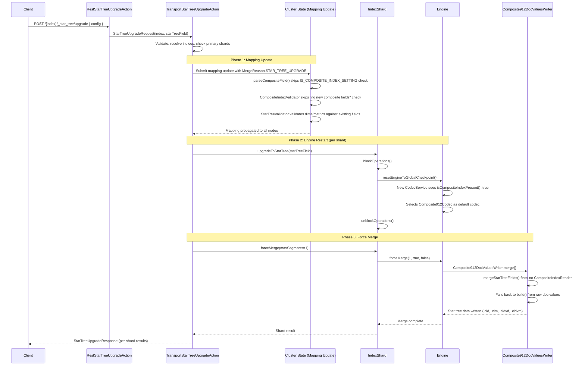
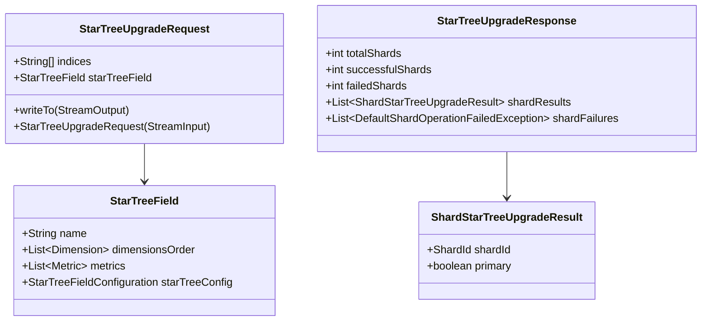
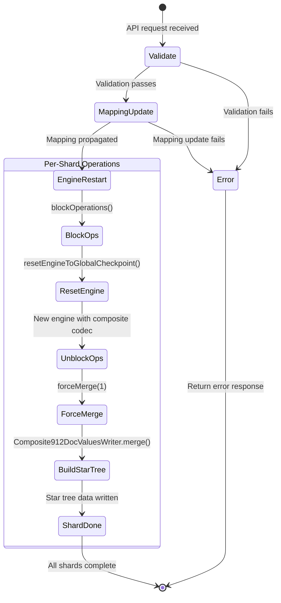

# Design Document: Star Tree Upgrade via Mapping

## Overview

This feature adds the ability to retroactively build star tree indexes on existing OpenSearch indices by working with the existing merge infrastructure rather than bypassing it. The approach is:

1. Update the index mapping to add star tree field configuration (bypassing `IS_COMPOSITE_INDEX_SETTING` and `CompositeIndexValidator` checks via a new `MergeReason`)
2. Restart the engine so the new `CodecService` picks up the composite codec (since `MapperService.isCompositeIndexPresent()` returns true after the mapping update)
3. Modify `Composite912DocValuesWriter.mergeStarTreeFields()` to build star trees from raw doc values when source segments lack star tree data
4. Run `forceMerge(1)` to rewrite all segments through the composite codec's merge path, which now builds star trees

The `index.composite_index` and `index.append_only_enabled` settings are NOT modified. The only gate on these settings is in `ObjectMapper.parseCompositeField()` during mapping parsing, which is bypassed for the upgrade path. `CodecService` selects the composite codec based solely on `MapperService.isCompositeIndexPresent()`, which checks `!getCompositeFieldTypes().isEmpty()` — no setting check involved.

## Architecture



## Components and Interfaces

### 1. MergeReason Extension

Add a new `STAR_TREE_UPGRADE` value to `MapperService.MergeReason`:

```java
public enum MergeReason {
    MAPPING_UPDATE_PREFLIGHT,
    MAPPING_UPDATE,
    INDEX_TEMPLATE,
    MAPPING_RECOVERY,
    STAR_TREE_UPGRADE;  // new
}
```

This merge reason is used to:
- Signal `ObjectMapper.parseCompositeField()` to skip the `IS_COMPOSITE_INDEX_SETTING` and `INDEX_APPEND_ONLY_ENABLED_SETTING` checks
- Signal `CompositeIndexValidator` to allow adding composite fields to an existing index

### 2. ObjectMapper.parseCompositeField() Modification

The `parseCompositeField()` method currently reads settings from `parserContext.getSettings()`. Since `ParserContext` doesn't carry a `MergeReason`, we need a way to signal the bypass. The cleanest approach is to add a boolean flag to `ParserContext`:

```java
// In Mapper.TypeParser.ParserContext
private boolean allowCompositeFieldWithoutSettings = false;

public boolean isAllowCompositeFieldWithoutSettings() {
    return allowCompositeFieldWithoutSettings;
}

public void setAllowCompositeFieldWithoutSettings(boolean allow) {
    this.allowCompositeFieldWithoutSettings = allow;
}
```

Then in `parseCompositeField()`:

```java
protected static void parseCompositeField(...) {
    if (parserContext.isAllowCompositeFieldWithoutSettings() == false) {
        if (StarTreeIndexSettings.IS_COMPOSITE_INDEX_SETTING.get(parserContext.getSettings()) == false) {
            throw new IllegalArgumentException(...);
        }
        if (IndexMetadata.INDEX_APPEND_ONLY_ENABLED_SETTING.get(parserContext.getSettings()) == false) {
            throw new IllegalArgumentException(...);
        }
    }
    // ... rest of parsing unchanged
}
```

The flag is set in `DocumentMapperParser` when parsing with `MergeReason.STAR_TREE_UPGRADE`, or alternatively the transport action sets it on the `MapperService` before invoking the merge.

### 3. CompositeIndexValidator Modification

In `MetadataMappingService.applyRequest()`, the `CompositeIndexValidator.validate()` call with 4 args blocks adding new composite fields. For the star tree upgrade path, we need to bypass this. The approach is to pass the `MergeReason` through the request or add an overload:

```java
// In CompositeIndexValidator
public static void validate(
    MapperService mapperService,
    CompositeIndexSettings compositeIndexSettings,
    IndexSettings indexSettings,
    boolean isCompositeFieldPresent,
    MergeReason mergeReason
) {
    if (mergeReason == MergeReason.STAR_TREE_UPGRADE) {
        // Skip the "no new composite fields during update" check
        // Still run StarTreeValidator to validate dims/metrics
        StarTreeValidator.validate(mapperService, compositeIndexSettings, indexSettings);
        return;
    }
    // ... existing logic
}
```

The `StarTreeValidator.validate()` still runs to ensure dimensions and metrics reference valid, aggregatable fields in the index.

### 4. Mapping Update via Cluster State

The transport action submits a cluster state update that:
1. Creates a `MapperService` for the target index
2. Sets the `allowCompositeFieldWithoutSettings` flag on the parser context
3. Merges the star tree mapping using `MergeReason.STAR_TREE_UPGRADE`
4. Calls `CompositeIndexValidator.validate()` with the upgrade merge reason
5. Commits the updated mapping to cluster state

This is implemented as a custom `ClusterStateTaskExecutor` in the transport action, similar to how `MetadataMappingService.PutMappingExecutor` works but with the upgrade-specific bypass logic.

### 5. Composite912DocValuesWriter.mergeStarTreeFields() Enhancement

The current `mergeStarTreeFields()` only collects existing `StarTreeValues` from source segments via `CompositeIndexReader`. When no source segments have star tree data (the upgrade case), `starTreeSubsPerField` is empty and `buildDuringMerge()` is a no-op.

The enhancement adds a fallback: when `starTreeSubsPerField` is empty but `mapperService.getCompositeFieldTypes()` returns star tree fields, build from raw doc values using the flush path:

```java
private void mergeStarTreeFields(MergeState mergeState) throws IOException {
    Map<String, List<StarTreeValues>> starTreeSubsPerField = new HashMap<>();
    // ... existing logic to collect StarTreeValues from CompositeIndexReader ...

    if (starTreeSubsPerField.isEmpty() && compositeMappedFieldTypes.isEmpty() == false) {
        // No source segments have star tree data, but mapping has star tree config.
        // Build from raw doc values (same as flush path).
        // The fieldProducerMap was already populated by super.merge() calling
        // addSortedNumericField/addSortedSetField on the merged segment's fields.
        // We need to build it from the mergeState's doc values producers.
        Map<String, DocValuesProducer> mergedFieldProducerMap = buildFieldProducerMapFromMergeState(mergeState);
        try (StarTreesBuilder starTreesBuilder = new StarTreesBuilder(state, mapperService, fieldNumberAcrossCompositeFields)) {
            starTreesBuilder.build(metaOut, dataOut, mergedFieldProducerMap, compositeDocValuesConsumer);
        }
    } else {
        try (StarTreesBuilder starTreesBuilder = new StarTreesBuilder(state, mapperService, fieldNumberAcrossCompositeFields)) {
            starTreesBuilder.buildDuringMerge(metaOut, dataOut, starTreeSubsPerField, compositeDocValuesConsumer);
        }
    }
}
```

The `buildFieldProducerMapFromMergeState()` method constructs a `fieldProducerMap` by wrapping the merged segment's doc values (which were already written by `super.merge()`) into `DocValuesProducer` instances. This uses the `mergeState` to access the merged doc values for each field referenced by the star tree configuration.

### 6. IndexShard.upgradeToStarTree()

A new method on `IndexShard` that orchestrates the per-shard upgrade:

```java
public void upgradeToStarTree() throws IOException, InterruptedException, TimeoutException {
    verifyActive();
    // Engine restart to pick up composite codec
    indexShardOperationPermits.blockOperations(30, TimeUnit.MINUTES, () -> {
        resetEngineToGlobalCheckpoint();
    });
    // Force merge to build star trees via the codec's merge path
    forceMerge(new ForceMergeRequest().maxNumSegments(1));
}
```

The engine restart happens inside `blockOperations` to ensure no concurrent writes. After unblocking, `forceMerge(1)` runs normally — the new engine's `IndexWriter` uses the composite codec, and the merge path in `Composite912DocValuesWriter` builds star trees from raw doc values.

### 7. Transport Action

`TransportStarTreeUpgradeAction` extends `TransportBroadcastByNodeAction` following the same pattern as `TransportUpgradeAction`:

```java
public class TransportStarTreeUpgradeAction extends TransportBroadcastByNodeAction<
    StarTreeUpgradeRequest, StarTreeUpgradeResponse, ShardStarTreeUpgradeResult> {

    @Override
    protected void doExecute(Task task, StarTreeUpgradeRequest request, ActionListener<StarTreeUpgradeResponse> listener) {
        // Phase 1: Submit mapping update to cluster state
        submitMappingUpdate(request, ActionListener.wrap(
            ack -> {
                // Phase 2 + 3: Engine restart + force merge (per shard, via broadcast)
                super.doExecute(task, request, listener);
            },
            listener::onFailure
        ));
    }

    @Override
    protected ShardStarTreeUpgradeResult shardOperation(StarTreeUpgradeRequest request, ShardRouting shardRouting) throws IOException {
        IndexShard indexShard = indicesService.indexServiceSafe(shardRouting.shardId().getIndex())
            .getShard(shardRouting.shardId().id());
        indexShard.upgradeToStarTree();
        return new ShardStarTreeUpgradeResult(shardRouting.shardId(), shardRouting.primary());
    }
}
```

The mapping update is done once (cluster-wide) before the per-shard broadcast. The per-shard operation handles engine restart and force merge.

### 8. REST Handler

```java
public class RestStarTreeUpgradeAction extends BaseRestHandler {
    @Override
    public List<Route> routes() {
        return List.of(new Route(POST, "/{index}/_star_tree/upgrade"));
    }

    @Override
    protected RestChannelConsumer prepareRequest(RestRequest request, NodeClient client) throws IOException {
        String index = request.param("index");
        StarTreeField starTreeField = parseStarTreeConfig(request.content(), request.getXContentType());
        StarTreeUpgradeRequest upgradeRequest = new StarTreeUpgradeRequest(index, starTreeField);
        return channel -> client.execute(StarTreeUpgradeAction.INSTANCE, upgradeRequest,
            new RestToXContentListener<>(channel));
    }
}
```

## Data Models

### Request/Response



### API Request Body

```json
{
  "star_tree": {
    "name": "my_star_tree",
    "type": "star_tree",
    "ordered_dimensions": [
      { "name": "timestamp" },
      { "name": "status" }
    ],
    "metrics": [
      { "name": "size", "stats": ["sum", "avg"] }
    ]
  }
}
```

### Upgrade Flow State Machine



### Key Design Decision: Why Not Change Settings

The `IS_COMPOSITE_INDEX_SETTING` is `Setting.Property.Final` — it cannot be changed after index creation through normal APIs. Bypassing this at the cluster state level (as the previous design proposed) is fragile and could have unintended side effects on other components that check this setting.

Instead, we bypass only the specific validation checks that gate on this setting:
1. `ObjectMapper.parseCompositeField()` — the setting check during mapping parsing
2. `CompositeIndexValidator` — the "no new composite fields" check during mapping updates

This is safer because:
- `CodecService` doesn't check the setting — it checks `mapperService.isCompositeIndexPresent()`
- `TransportBulkAction` checks `INDEX_APPEND_ONLY_ENABLED_SETTING` for write restrictions — since we don't change it, writes continue normally
- No other production code paths check `IS_COMPOSITE_INDEX_SETTING` at runtime


## Correctness Properties

*A property is a characteristic or behavior that should hold true across all valid executions of a system — essentially, a formal statement about what the system should do. Properties serve as the bridge between human-readable specifications and machine-verifiable correctness guarantees.*

The following properties were derived from the acceptance criteria through prework analysis. Each property is universally quantified and suitable for property-based testing.

### Property 1: Star tree config XContent parsing round-trip

*For any* valid star tree configuration (with valid dimensions, metrics, and optional build parameters), serializing it to XContent (JSON request body format) and parsing it back SHALL produce an equivalent StarTreeField object.

**Validates: Requirements 1.2**

### Property 2: Star tree config transport serialization round-trip

*For any* valid StarTreeField object, serializing it to transport wire format (via `writeTo(StreamOutput)`) and deserializing it back (via `new StarTreeUpgradeRequest(StreamInput)`) SHALL produce an equivalent StarTreeField object.

**Validates: Requirements 9.2**

### Property 3: Invalid config rejection

*For any* request body that is missing required star tree fields (no dimensions, no metrics, or malformed structure), the parser SHALL reject it with a descriptive error and not proceed with the upgrade.

**Validates: Requirements 1.3**

### Property 4: Upgrade merge reason bypasses setting checks

*For any* valid star tree configuration and any index settings where `index.composite_index` is false and `index.append_only_enabled` is false, when the `allowCompositeFieldWithoutSettings` flag is set (or `MergeReason.STAR_TREE_UPGRADE` is used), `parseCompositeField()` SHALL succeed without throwing an `IllegalArgumentException`, and `CompositeIndexValidator.validate()` SHALL allow the composite field addition.

**Validates: Requirements 2.1, 2.2**

### Property 5: Mapping update populates composite field types

*For any* valid star tree configuration merged into a MapperService, `getCompositeFieldTypes()` SHALL return a non-empty set containing a `StarTreeFieldType` with dimensions and metrics matching the input configuration.

**Validates: Requirements 2.4**

### Property 6: Index settings invariant during upgrade

*For any* star tree upgrade operation on any index, the values of `index.composite_index` and `index.append_only_enabled` settings SHALL remain unchanged after the upgrade completes (whether successful or failed).

**Validates: Requirements 2.7, 2.8**

### Property 7: Merge builds star trees from raw doc values when no source star tree data exists

*For any* set of segments that do not contain star tree data, when merged using `Composite912DocValuesWriter` with a `MapperService` that has star tree field configuration, the resulting merged segment SHALL contain star tree data built from the raw doc values.

**Validates: Requirements 4.1**

### Property 8: Mixed segment merge produces correct star tree data

*For any* set of segments where some contain existing star tree data and some do not, when merged using `Composite912DocValuesWriter` with a `MapperService` that has star tree field configuration, the resulting merged segment SHALL contain valid star tree data that covers all documents from all source segments.

**Validates: Requirements 4.3**

## Error Handling

### Configuration Validation Errors

When the API request body does not contain a valid star tree configuration:
1. The REST handler rejects the request before any cluster state changes
2. An `IllegalArgumentException` is thrown with a descriptive message indicating what is missing or invalid
3. No mapping or settings changes occur

When the star tree configuration references fields that don't exist in the index:
1. The `StarTreeValidator.validate()` call catches this during the mapping update
2. The cluster state update fails and is not committed
3. An error response is returned with details about the missing/incompatible fields

### Mapping Update Errors

When the mapping merge fails:
1. The cluster state task executor catches the exception
2. The cluster state is not modified (atomic — either the whole update succeeds or nothing changes)
3. The error propagates to the transport action, which returns it to the client
4. No engine restart or force merge is attempted

### Engine Restart Errors

When `resetEngineToGlobalCheckpoint()` fails:
1. The exception propagates from within the `blockOperations` callback
2. The shard's operation permits are released (the `blockOperations` callback completes)
3. The shard may need manual recovery (similar to other engine failure scenarios)
4. The error is reported in the per-shard response

### Force Merge Errors

When `forceMerge(1)` fails on a shard:
1. Lucene's atomic commit protocol ensures the original segments remain intact
2. The mapping update is already committed to cluster state and remains in place
3. The error is reported in the per-shard response
4. The operator can retry the upgrade — the idempotency logic (Requirement 8.2) detects the mapping is already present and skips to force merge

### Concurrent Upgrade Rejection

When a second upgrade request arrives while one is in progress:
1. The `blockOperations` call on the shard will fail or timeout if operations are already blocked
2. The transport action reports the failure for that shard
3. The first upgrade continues unaffected

## Testing Strategy

### Unit Tests

Unit tests focus on individual components in isolation:

1. **Config parsing**: Test that valid request bodies produce correct `StarTreeField` objects, and invalid bodies are rejected with descriptive errors
2. **Bypass logic**: Test that `parseCompositeField()` succeeds with `allowCompositeFieldWithoutSettings=true` even when `IS_COMPOSITE_INDEX_SETTING=false`
3. **CompositeIndexValidator bypass**: Test that `validate()` with `STAR_TREE_UPGRADE` merge reason allows adding composite fields
4. **Settings invariant**: Test that the upgrade path does not modify `index.composite_index` or `index.append_only_enabled`
5. **Transport serialization**: Test `StarTreeUpgradeRequest` serialization/deserialization round-trip

### Integration Tests (Internal Cluster Tests)

Integration tests verify the end-to-end flow using `OpenSearchIntegTestCase`:

1. **Full upgrade flow**: Create a non-star-tree index → index documents → call upgrade API → verify star tree data files exist and search queries use star tree path
2. **Idempotent upgrade**: Upgrade → upgrade again → verify second call returns success with no work needed
3. **Partial retry**: Upgrade with simulated force merge failure → retry → verify force merge completes
4. **Invalid config rejection**: Call upgrade API with missing dimensions → verify error response
5. **Already-configured rejection**: Create index with star tree → call upgrade API → verify rejection
6. **Concurrent upgrade rejection**: Start two upgrades on same index → verify second is rejected

### Property-Based Tests

Property-based tests use jqwik (Java property-based testing library) with minimum 100 iterations per property. Each property test generates random inputs and verifies the universal property holds.

- **Property 1 (XContent parsing round-trip)**: Generate random valid StarTreeField configs, serialize to XContent, parse back, assert equivalence
  - Tag: **Feature: star-tree-upgrade-via-mapping, Property 1: Star tree config XContent parsing round-trip**

- **Property 2 (Transport serialization round-trip)**: Generate random valid StarTreeUpgradeRequest objects, serialize via writeTo, deserialize via constructor, assert equivalence
  - Tag: **Feature: star-tree-upgrade-via-mapping, Property 2: Star tree config transport serialization round-trip**

- **Property 3 (Invalid config rejection)**: Generate random invalid request bodies (missing dims, missing metrics, malformed), assert rejection with error
  - Tag: **Feature: star-tree-upgrade-via-mapping, Property 3: Invalid config rejection**

- **Property 4 (Upgrade bypass)**: Generate random valid star tree configs with IS_COMPOSITE_INDEX_SETTING=false, parse with allowCompositeFieldWithoutSettings=true, assert success
  - Tag: **Feature: star-tree-upgrade-via-mapping, Property 4: Upgrade merge reason bypasses setting checks**

- **Property 5 (Composite field types populated)**: Generate random valid star tree configs, merge into MapperService, assert getCompositeFieldTypes() returns matching StarTreeFieldType
  - Tag: **Feature: star-tree-upgrade-via-mapping, Property 5: Mapping update populates composite field types**

- **Property 6 (Settings invariant)**: Generate random upgrade scenarios, verify index.composite_index and index.append_only_enabled remain unchanged
  - Tag: **Feature: star-tree-upgrade-via-mapping, Property 6: Index settings invariant during upgrade**

- **Property 7 (Merge from raw doc values)**: Generate random segments without star tree data, merge with star tree config in MapperService, assert resulting segment has star tree data
  - Tag: **Feature: star-tree-upgrade-via-mapping, Property 7: Merge builds star trees from raw doc values when no source star tree data exists**

- **Property 8 (Mixed segment merge)**: Generate random mixes of segments with and without star tree data, merge, assert resulting segment has valid star tree data covering all documents
  - Tag: **Feature: star-tree-upgrade-via-mapping, Property 8: Mixed segment merge produces correct star tree data**
