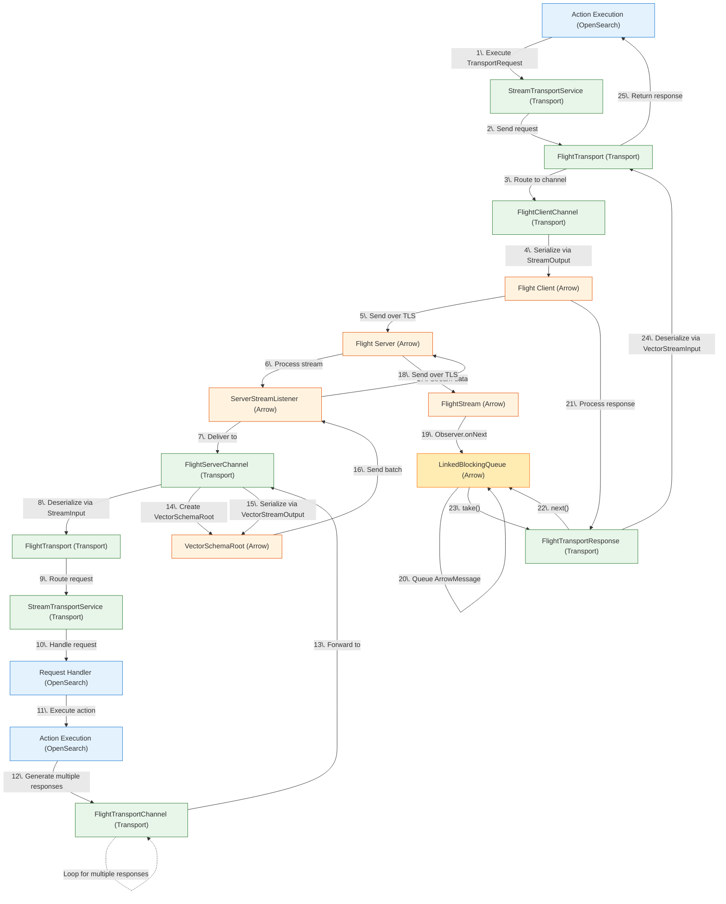

# Arrow Flight RPC Node-to-Node Architecture

```mermaid
flowchart TD
%% OpenSearch Layer
    ClientAction["Action Execution (OpenSearch)"]
    ServerAction["Action Execution (OpenSearch)"]
    ServerRH["Request Handler (OpenSearch)"]

%% Transport Layer
    ClientTS["StreamTransportService (Transport)"]
    ClientFT["FlightTransport (Transport)"]
    ClientFCC["FlightClientChannel (Transport)"]
    ClientFTR["FlightTransportResponse (Transport)"]

    ServerTS["StreamTransportService (Transport)"]
    ServerFT["FlightTransport (Transport)"]
    ServerFTC["FlightTransportChannel (Transport)"]
    ServerFSC["FlightServerChannel (Transport)"]

%% Arrow Flight Layer
    FC["Flight Client (Arrow)"]
    FS["FlightStream (Arrow)"]
    FSQueue["LinkedBlockingQueue (Arrow)"]
    FSrv["Flight Server (Arrow)"]
    SSL["ServerStreamListener (Arrow)"]
    VSR["VectorSchemaRoot (Arrow)"]

%% Request Flow
    ClientAction -->|"1\. Execute TransportRequest"| ClientTS
    ClientTS -->|"2\. Send request"| ClientFT
    ClientFT -->|"3\. Route to channel"| ClientFCC
    ClientFCC -->|"4\. Serialize via StreamOutput"| FC
    FC -->|"5\. Send over TLS"| FSrv
    FSrv -->|"6\. Process stream"| SSL
    SSL -->|"7\. Deliver to"| ServerFSC
    ServerFSC -->|"8\. Deserialize via StreamInput"| ServerFT
    ServerFT -->|"9\. Route request"| ServerTS
    ServerTS -->|"10\. Handle request"| ServerRH
    ServerRH -->|"11\. Execute action"| ServerAction

%% Response Flow - Multiple responses
    ServerAction -->|"12\. Generate multiple responses"| ServerFTC
    ServerFTC -->|"13\. Forward to"| ServerFSC
    ServerFSC -->|"14\. Create VectorSchemaRoot"| VSR
    ServerFSC -->|"15\. Serialize via VectorStreamOutput"| VSR
    VSR -->|"16\. Send batch"| SSL
    SSL -->|"17\. Stream data"| FSrv
    FSrv -->|"18\. Send over TLS"| FS

%% Message Buffering Detail
    FS -->|"19\. Observer.onNext"| FSQueue
    FSQueue -->|"20\. Queue ArrowMessage"| FSQueue

%% Response Processing
    FC -->|"21\. Process response"| ClientFTR
    ClientFTR -->|"22\. next()"| FSQueue
    FSQueue -->|"23\. take()"| ClientFTR
    ClientFTR -->|"24\. Deserialize via VectorStreamInput"| ClientFT
    ClientFT -->|"25\. Return response"| ClientAction

%% Multiple response loop
    ServerFTC -.->|"Loop for multiple responses"| ServerFTC

%% Layout adjustments
    ClientAction ~~~ ClientTS ~~~ ClientFT ~~~ ClientFCC
    ServerAction ~~~ ServerFTC ~~~ ServerFSC
    FC ~~~ FS ~~~ FSQueue

%% Style
    classDef opensearch fill:#e3f2fd,stroke:#1976d2
    classDef transport fill:#e8f5e9,stroke:#2e7d32
    classDef arrow fill:#fff3e0,stroke:#e65100
    classDef queue fill:#ffecb3,stroke:#ff6f00

    class ClientAction,ServerAction,ServerRH opensearch
    class ClientTS,ClientFT,ClientFCC,ClientFTR,ServerTS,ServerFT,ServerFTC,ServerFSC transport
    class FC,FS,FSrv,SSL,VSR arrow
    class FSQueue queue
```
