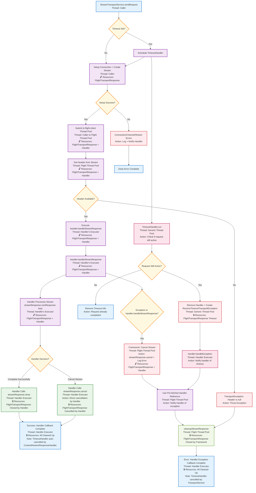

# Flight Client Channel Stream Processing Flow and Error Handling

```mermaid
flowchart TD
    %% Entry Point
    A[StreamTransportService.sendRequest<br/>Thread: Caller] --> A1{Timeout Set?}
    A1 -->|Yes| A2[Schedule TimeoutHandler]
    A1 -->|No| SETUP
    A2 --> SETUP[Setup Connection + Create Stream<br/>Thread: Caller<br/>🔓 Resources: FlightTransportResponse]

    SETUP --> SETUP_CHECK{Setup Success?}
    SETUP_CHECK -->|No| EARLY_ERROR[Connection/Channel/Stream Errors<br/>Action: Log + Notify Handler]
    SETUP_CHECK -->|Yes| L[Submit to flight-client Thread Pool<br/>Thread: Caller to Flight Thread Pool<br/>🔓 Resources: FlightTransportResponse + Handler]

    %% Async Processing in Flight Thread Pool
    L --> VALIDATE[Get Header from Stream<br/>Thread: Flight Thread Pool<br/>🔓 Resources: FlightTransportResponse + Handler]
    VALIDATE --> VALIDATE_CHECK{Header Available?}
    VALIDATE_CHECK -->|No| VALIDATE_ERROR[TransportException: Header is null<br/>Action: Throw Exception]
    VALIDATE_CHECK -->|Yes| EXECUTE_HANDLER[Execute handler.handleStreamResponse<br/>Thread: Handler's Executor<br/>🔓 Resources: FlightTransportResponse + Handler]

    EXECUTE_HANDLER --> X[handler.handleStreamResponse<br/>Thread: Handler's Executor<br/>🔓 Resources: FlightTransportResponse + Handler]

    %% Stream Processing Success Path
    X --> Y[Handler Processes Stream<br/>streamResponse.nextResponse loop<br/>Thread: Handler's Executor<br/>🔓 Resources: FlightTransportResponse + Handler]
    Y --> YY{Handler Decision?}
    YY -->|Complete Successfully| Z[Handler Calls streamResponse.close<br/>Thread: Handler Executor<br/>🔒 Resources: FlightTransportResponse Closed by Handler]
    YY -->|Cancel Stream| ZZ[Handler Calls streamResponse.cancel<br/>Thread: Handler Executor<br/>Action: Direct cancellation by handler<br/>🔒 Resources: FlightTransportResponse Cancelled by Handler]
    Z --> BB[Success: Handler Callback Complete<br/>Thread: Handler Executor<br/>🔒 Resources: All Cleaned Up<br/>Note: TimeoutHandler auto-cancelled by ContextRestoreResponseHandler]
    ZZ --> BB

    %% Timeout Path
    A2 --> TT[TimeoutHandler.run<br/>Thread: Generic Thread Pool<br/>Action: Check if request still active]
    TT --> TTT{Request Still Active?}
    TTT -->|No| TTTT[Remove Timeout Info<br/>Action: Request already completed]
    TTT -->|Yes| TTTTT[Remove Handler + Create ReceiveTimeoutTransportException<br/>Thread: Generic Thread Pool<br/>🔒 Resources: FlightTransportResponse Timeout]
    TTTTT --> TTTTTT[handler.handleException<br/>Thread: Handler Executor<br/>Action: Notify handler of timeout]

    %% Error Handling Paths - Only for Exceptions
    X --> CC{Exception in handler.handleStreamResponse?}
    CC -->|Yes| DD[Framework: Cancel Stream<br/>Thread: Flight Thread Pool<br/>Action: streamResponse.cancel + Log Error<br/>🔓 Resources: FlightTransportResponse + Handler]

    DD --> EXCEPTION_HANDLER[Use Pre-fetched Handler Reference<br/>Thread: Flight Thread Pool<br/>Action: Notify handler of exception]
    TTTTTT --> EXCEPTION_HANDLER

    EXCEPTION_HANDLER --> LL[cleanupStreamResponse<br/>Thread: Flight Thread Pool<br/>🔒 Resources: FlightTransportResponse Closed by Framework]
    LL --> OO[Error: Handler Exception Callback Complete<br/>Thread: Handler Executor<br/>🔒 Resources: All Cleaned Up<br/>Note: TimeoutHandler cancelled by TransportService]

    %% Resource Cleanup Always Happens
    VALIDATE_ERROR --> LL
    EARLY_ERROR --> ERROR_COMPLETE[Early Error Complete]

    %% Logical Color Scheme
    classDef startEnd fill:#e3f2fd,stroke:#1976d2,stroke-width:2px
    classDef decision fill:#fff8e1,stroke:#f57c00,stroke-width:2px
    classDef process fill:#f3e5f5,stroke:#7b1fa2,stroke-width:2px
    classDef success fill:#e8f5e8,stroke:#388e3c,stroke-width:2px
    classDef error fill:#ffebee,stroke:#d32f2f,stroke-width:2px
    classDef timeout fill:#fce4ec,stroke:#c2185b,stroke-width:2px
    classDef cleanup fill:#f1f8e9,stroke:#689f38,stroke-width:2px

    class A,BB,OO,ERROR_COMPLETE,TTTT startEnd
    class A1,SETUP_CHECK,VALIDATE_CHECK,YY,CC,TTT decision
    class A2,SETUP,L,VALIDATE,EXECUTE_HANDLER,X,Y,EXCEPTION_HANDLER process
    class Z,ZZ success
    class EARLY_ERROR,VALIDATE_ERROR,DD,TTTTT error
    class TT,TTTTTT timeout
    class LL cleanup
```
