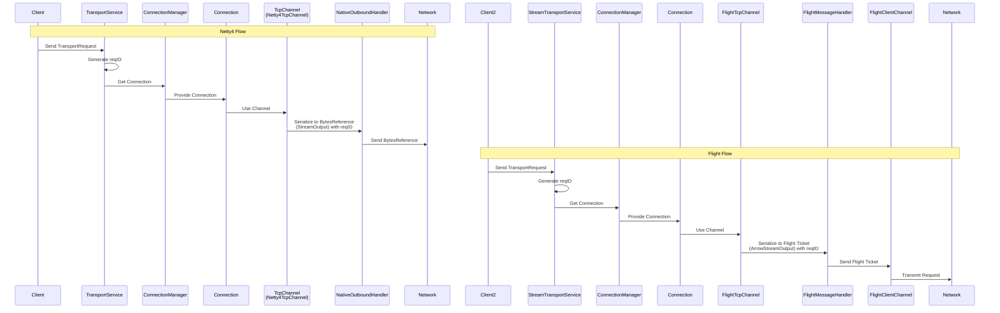
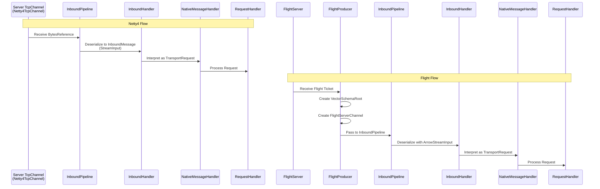
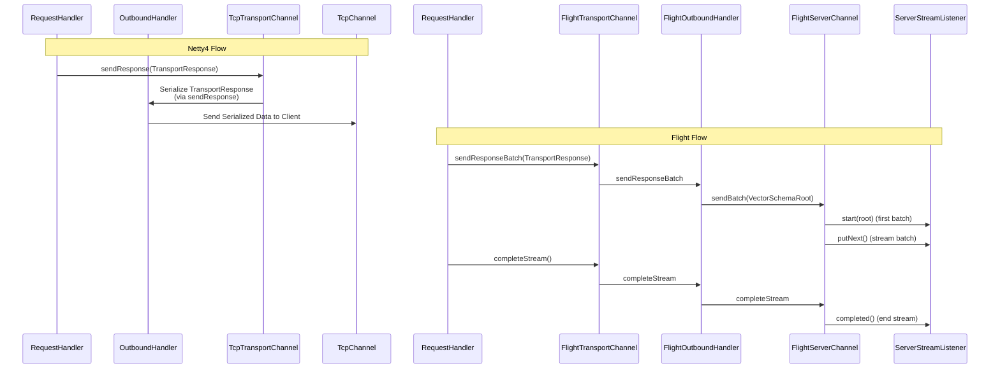
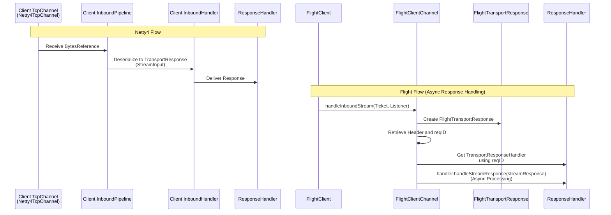

# Netty4 vs Flight Transport Comparison

This document compares the traditional Netty4 transport with the new Arrow Flight transport across all four communication flows.

## 1. Outbound Client: Netty4 vs. Flight

## 2. Inbound Server: Netty4 vs. Flight

## 3. Outbound Server: Netty4 vs. Flight

## 4. Inbound Client: Netty4 vs. Flight

## Key Differences Summary

### **Netty4 Transport (Traditional)**:
- **Request/Response**: Single request → single response pattern
- **Serialization**: BytesReference with StreamOutput/StreamInput
- **Channel**: Netty4TcpChannel with native handlers
- **Processing**: Synchronous response handling
- **Protocol**: Custom binary protocol over TCP

### **Flight Transport (New)**:
- **Streaming**: Single request → multiple response batches
- **Serialization**: Arrow Flight Ticket with ArrowStreamOutput/ArrowStreamInput
- **Channel**: FlightClientChannel/FlightServerChannel with Flight handlers
- **Processing**: Asynchronous stream processing with `nextResponse()` loop
- **Protocol**: Arrow Flight RPC over gRPC
