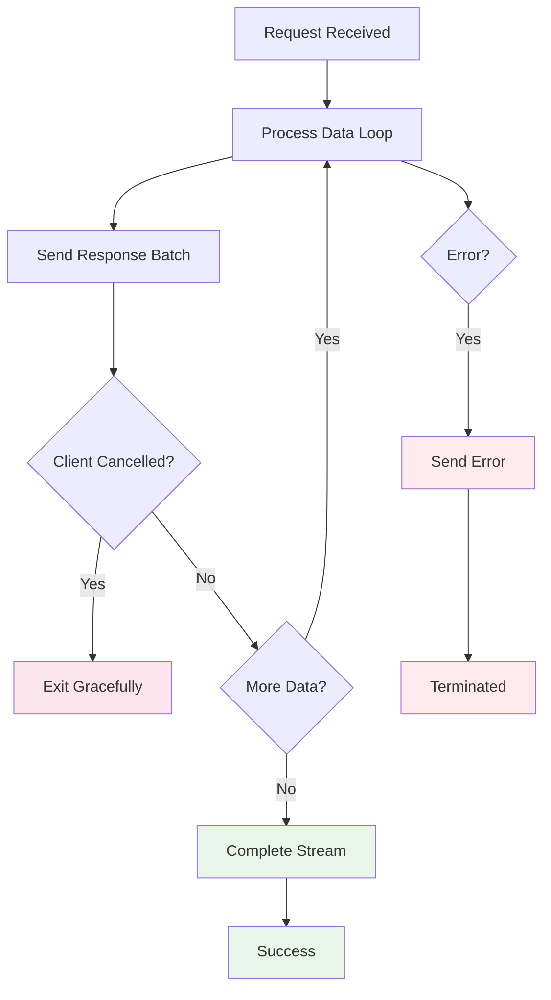

# Server-Side Streaming API Guide

## Overview

Server-side streaming allows sending multiple response batches to a client over a single connection. This is ideal for large result sets, real-time data, or progressive processing.

## Action Registration

```java
streamTransportService.registerRequestHandler(
    "internal:my-action/stream",
    ThreadPool.Names.SEARCH,
    MyRequest::new,
    this::handleStreamRequest
);
```

## Basic Implementation

```java
private void handleStreamRequest(MyRequest request, TransportChannel channel, Task task) {
    try {
        // Process data incrementally
        DataIterator iterator = createDataIterator(request);
        
        while (iterator.hasNext()) {
            MyData data = iterator.next();
            MyResponse response = processData(data);
            
            // Send batch - may block or throw StreamException with CANCELLED code
            channel.sendResponseBatch(response);
        }
        
        // Signal successful completion
        channel.completeStream();
        
    } catch (StreamException e) {
        if (e.getErrorCode() == StreamErrorCode.CANCELLED) {
            // Client cancelled - exit gracefully
            logger.info("Stream cancelled by client: {}", e.getMessage());
            // Do NOT call completeStream() or sendResponse()
        } else {
            // Other stream error - send to client
            channel.sendResponse(e);
        }
        
    } catch (Exception e) {
        // Send error to client
        channel.sendResponse(e);
    }
}
```

## Processing Flow



## Key Behaviors

### Blocking
- `sendResponseBatch()` may block if transport buffers are full
- Server will pause until client consumes data and frees buffer space

### Cancellation
- `sendResponseBatch()` throws `StreamException` with `StreamErrorCode.CANCELLED` when client cancels
- Exit handler immediately - framework handles cleanup
- Do NOT call `completeStream()` or `sendResponse()` after cancellation

### Completion
- Always call either `completeStream()` (success) OR `sendResponse(exception)` (error)
- Never call both methods
- Stream must be explicitly completed or terminated