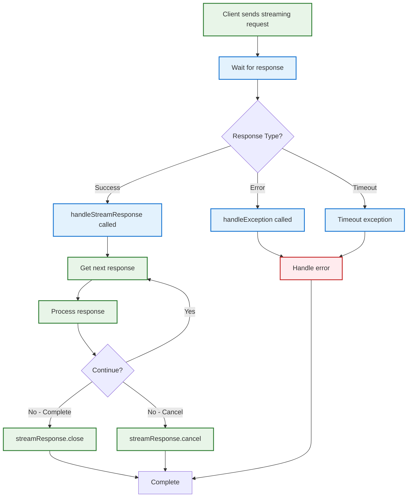

# Client-Side Streaming API Flow



## Simple Client Usage

### **Thread-Safe Implementation**:
```java
StreamTransportResponseHandler<MyResponse> handler = new StreamTransportResponseHandler<MyResponse>() {
    private volatile boolean cancelled = false;
    private volatile StreamTransportResponse<MyResponse> currentStream;
    
    @Override
    public void handleStreamResponse(StreamTransportResponse<MyResponse> streamResponse) {
        currentStream = streamResponse;
        
        if (cancelled) {
            handleTermination(streamResponse, "Handler already cancelled", null);
            return;
        }
        
        try {
            MyResponse response;
            while ((response = streamResponse.nextResponse()) != null) {  // BLOCKING CALL
                if (cancelled) {
                    handleTermination(streamResponse, "Processing cancelled", null);
                    return;
                }
                processResponse(response);
            }
            streamResponse.close();
        } catch (Exception e) {
            handleTermination(streamResponse, "Error: " + e.getMessage(), e);
        }
    }
    
    @Override
    public void handleException(TransportException exp) {
        cancelled = true;
        if (currentStream != null) {
            handleTermination(currentStream, "Exception occurred: " + exp.getMessage(), exp);
        }
        handleError(exp);
    }
    
    // Placeholder for custom termination logic
    private void handleTermination(StreamTransportResponse<MyResponse> streamResponse, String reason, Exception cause) {
        // Add custom cleanup/logging logic here
        streamResponse.cancel(reason, cause);
    }
};

transportService.sendRequest(node, "action", request, 
    TransportRequestOptions.builder().withType(STREAM).withTimeout(30s).build(), 
    handler);
```

### **Key Points**:
- **Blocking**: `nextResponse()` blocks waiting for server data - use background threads
- **Timeout Handling**: `handleException` can cancel active streams for timeout scenarios
- **Always Close/Cancel**: Stream must be closed or cancelled to prevent resource leaks