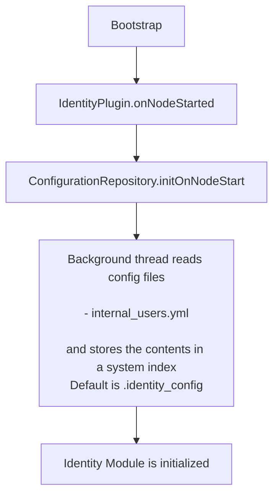
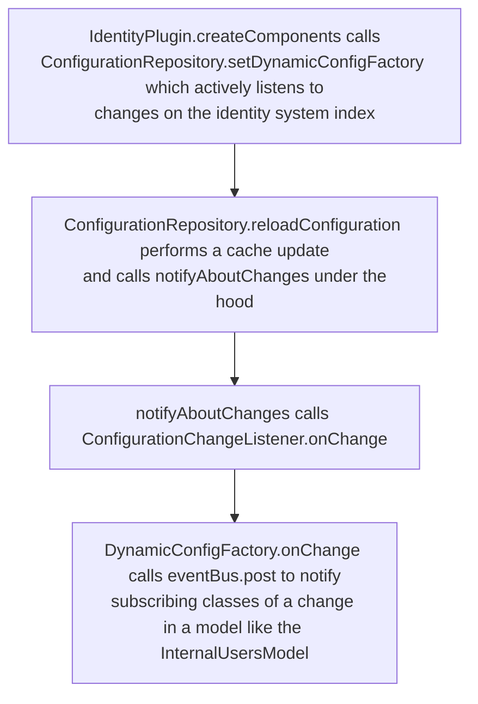

## Identity System Index Initialization

```mermaid
flowchart TD;
  bs[Bootstrap]-->ons[IdentityPlugin.onNodeStarted];
  ons-->ions[ConfigurationRepository.initOnNodeStart];
  ions-->bg[Background thread reads config files<br/><br/>- internal_users.yml<br/><br/>and stores the contents in a system index<br/>Default is .identity_config];
  bg-->imi[Identity Module is initialized];
```

## Config Update

```mermaid
flowchart TD;
  ip[IdentityPlugin.createComponents calls<br/>ConfigurationRepository.setDynamicConfigFactory which actively listens to<br/>changes on the identity system index]-->rc[ConfigurationRepository.reloadConfiguration performs a cache update<br/> and calls notifyAboutChanges under the hood];
  rc-->nac[notifyAboutChanges calls ConfigurationChangeListener.onChange];
  nac-->dcf[DynamicConfigFactory.onChange calls eventBus.post to notify<br/>subscribing classes of a change in a model like the InternalUsersModel];
```
