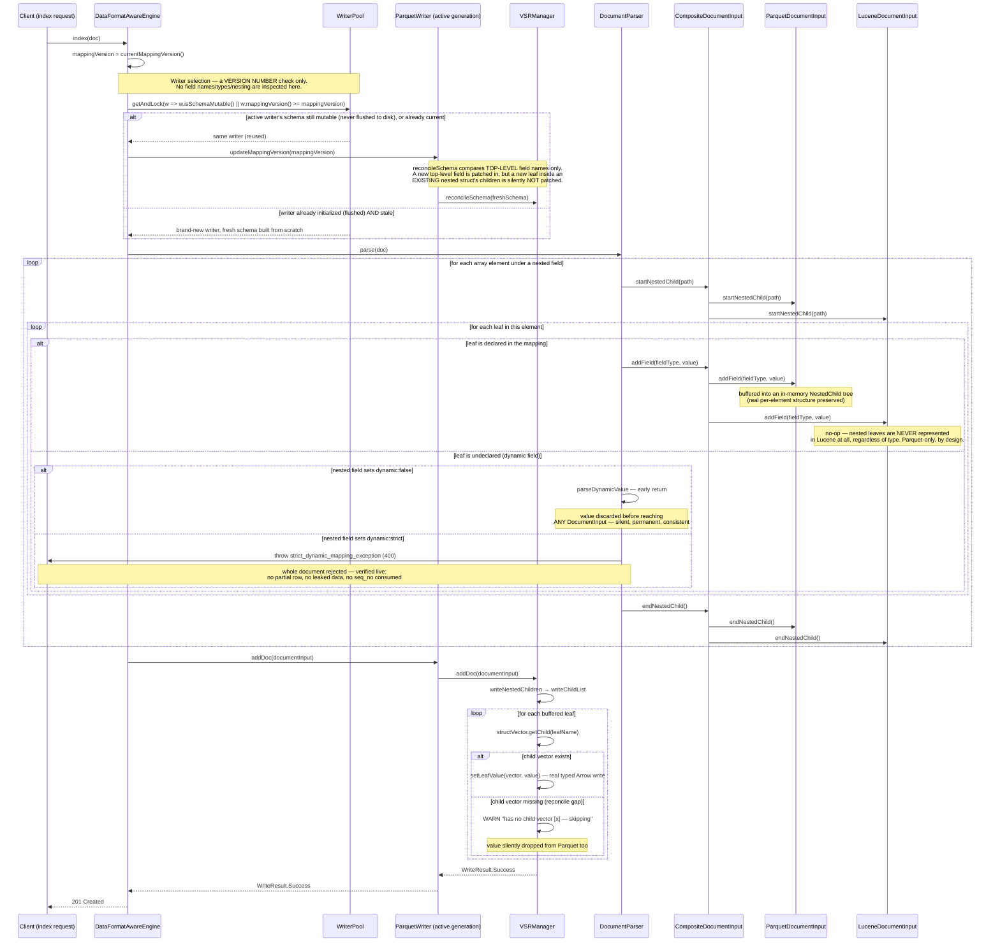

# Nested field ingestion — sequence diagram

Documents the full path a document with a `nested` field takes on a composite
(Parquet primary + Lucene secondary) index, from the write call through writer
selection, document parsing, and the per-format write paths. Every behavior
shown here — including the decision and the gap called out at the bottom —
has been verified against a running node, not just read from source.

## Sequence diagram

## Decisions and gaps this diagram reflects

1. **Nested and `flat_object` data is Parquet-only — Lucene represents none of
   it, by decision, not by limitation.** Earlier, Lucene flattened keyword/text
   nested leaves into a shared doc-values field and skipped other types; that
   was superseded — Lucene now does nothing at all for anything inside a
   nested scope, or for any `flat_object` entry (root or nested). This
   eliminates the correlation-loss and type-loss concerns that flattening had,
   at the cost of Lucene being unable to answer even a single-leaf
   existence/term query for nested data — every nested/`flat_object` query
   must go through Parquet/DataFusion.
2. **Schema reconciliation is top-level-name-only** (`VSRManager.reconcileSchema`).
   A new leaf added to an *already-active* nested field's `properties` (via a
   mapping update) is not reliably patched into the running writer's struct —
   reproduced live in 4 of 5 runs (writer not yet flushed → reused → silently
   dropped from Parquet; writer already flushed → new generation → safe). Not
   introduced by the nested-field work; pre-existing in
   `VSRManager.reconcileSchema`/`DataFormatAwareEngine`'s writer-selection
   predicate. Since Lucene no longer carries any nested data at all, this gap
   no longer manifests as *divergence between formats* — but it is not
   thereby safer: Parquet is now the only copy of nested data, so when this
   gap drops a value, it is lost everywhere, with no secondary copy to fall
   back on. This gap is unaffected by decision 1 and still needs its own fix.

`dynamic:false` and `dynamic:strict` are both confirmed safe against silent
cross-format divergence for *undeclared* fields; neither protects against
gap 2, since that's triggered by an explicit, declared mapping change, not
dynamic field discovery.
