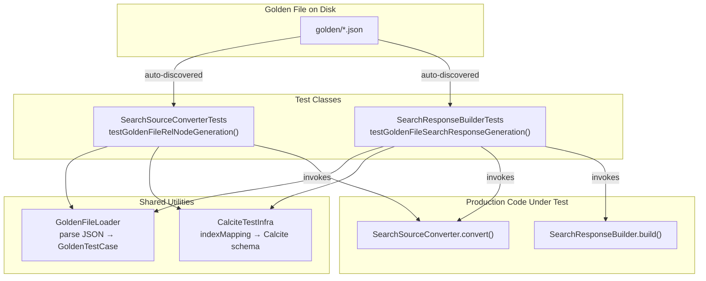
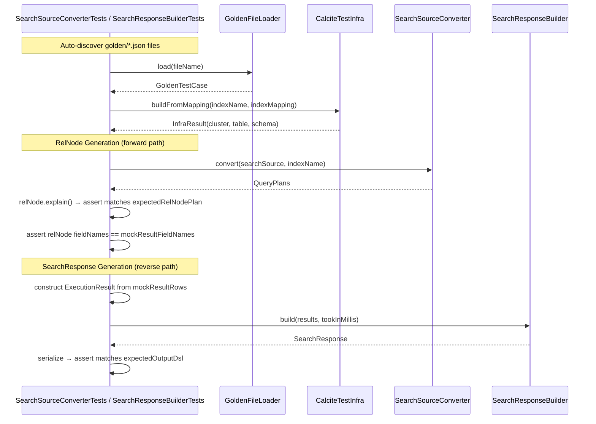

# DSL Golden File Tests

## Overview

Golden-file-based test framework for the `dsl-query-executor` plugin. The framework validates two conversion paths:

1. **RelNode Generation** (forward path): DSL (`SearchSourceBuilder`) → Calcite `RelNode` logical plan via `SearchSourceConverter.convert()`
2. **SearchResponse Generation** (reverse path): Mock `ExecutionResult` rows → `SearchResponse` via `SearchResponseBuilder.build()`

Each golden file is a self-contained JSON document encoding the input DSL, expected RelNode plan, mock result rows, and expected output DSL. Tests auto-discover all `.json` files in `src/test/resources/golden/`, so adding a new test case requires only adding a new JSON file — no Java code changes needed.

The framework runs as pure unit tests with zero cluster dependency. It constructs Calcite infrastructure (RelOptCluster, type factory, catalog reader) directly from the golden file's `indexMapping`, mirroring the pattern in `TestUtils`.

## Architecture



The architecture has three layers:

1. **Data Layer** — `GoldenTestCase` POJO and `GoldenFileLoader` handle JSON parsing. `CalciteTestInfra` builds Calcite schemas from golden file mappings.
2. **Forward Path** — `SearchSourceConverterTests.testGoldenFileRelNodeGeneration()` auto-discovers all golden files, converts each `inputDsl` via `SearchSourceConverter`, and asserts the `RelNode.explain()` output matches `expectedRelNodePlan`. Also validates that RelNode field names match `mockResultFieldNames`.
3. **Reverse Path** — `SearchResponseBuilderTests.testGoldenFileSearchResponseGeneration()` auto-discovers all golden files, builds an `ExecutionResult` from mock rows, invokes `SearchResponseBuilder.build()`, and asserts the serialized response matches `expectedOutputDsl` (ignoring non-deterministic fields like `took`, `_shards`, `_score`).

### Key Design Decisions

- **Auto-discovery over per-file test methods**: Tests loop over all `golden/*.json` files. Failures are collected with file names for traceability, then reported together.
- **Integration into existing test classes**: Forward path tests live in `SearchSourceConverterTests`, reverse path in `SearchResponseBuilderTests` — no separate test class needed, reducing duplication.
- **JSON golden files**: JSON is natively supported by OpenSearch's `XContentParser` and `SearchSourceBuilder.fromXContent()`, avoiding extra dependencies.
- **Deterministic RelNode serialization**: Uses `RelNode.explain()` to produce a stable, human-readable plan string.
- **Schema from golden file, not from cluster**: Each golden file carries an `indexMapping` field used to construct a Calcite `RelDataType` directly, eliminating any need for a live cluster.
- **Plan as array of strings**: `expectedRelNodePlan` is a JSON array (one string per line) rather than a `\n`-delimited string, improving readability in golden files.

## Components

### GoldenTestCase

POJO representing a single parsed golden file:

```java
public class GoldenTestCase {
    private String testName;
    private String indexName;
    private Map<String, String> indexMapping;       // field name → SQL type name
    private Map<String, Object> inputDsl;           // raw JSON map for SearchSourceBuilder
    private List<String> expectedRelNodePlan;       // expected RelNode.explain() lines
    private List<String> mockResultFieldNames;      // column names for mock result rows
    private List<List<Object>> mockResultRows;      // simulated result rows
    private Map<String, Object> expectedOutputDsl;  // expected SearchResponse JSON
    private String planType;                        // "HITS" or "AGGREGATION"
}
```

### GoldenFileLoader

Parses and validates golden files:

```java
public class GoldenFileLoader {
    /** Parses a single golden file by name from src/test/resources/golden/ */
    public static GoldenTestCase load(String goldenFileName);

    /** Parses a single golden file from a file-system path */
    public static GoldenTestCase load(Path goldenFilePath);
}
```

### CalciteTestInfra

Builds Calcite planning infrastructure from a golden file's index mapping:

```java
public class CalciteTestInfra {
    /** Builds a RelOptCluster, schema, and catalog reader from indexMapping */
    public static InfraResult buildFromMapping(String indexName, Map<String, String> indexMapping);

    public record InfraResult(RelOptCluster cluster, RelOptTable table, SchemaPlus schema) {}
}
```

### Interaction Flow



## Golden File JSON Schema

```json
{
  "testName": "term_query_hits",
  "indexName": "test-index",
  "indexMapping": {
    "name": "VARCHAR",
    "price": "INTEGER",
    "brand": "VARCHAR",
    "rating": "DOUBLE"
  },
  "planType": "HITS",
  "inputDsl": {
    "query": {
      "term": { "name": { "value": "laptop" } }
    },
    "size": 10
  },
  "expectedRelNodePlan": [
    "LogicalSort(fetch=[10])",
    "  LogicalProject(name=[$0], price=[$1], brand=[$2], rating=[$3])",
    "    LogicalFilter(condition=[=($0, 'laptop')])",
    "      LogicalTableScan(table=[[test-index]])"
  ],
  "mockResultFieldNames": ["name", "price", "brand", "rating"],
  "mockResultRows": [
    ["laptop", 999, "BrandA", 4.5],
    ["laptop", 1299, "BrandB", 4.8]
  ],
  "expectedOutputDsl": {
    "hits": {
      "total": { "value": 2, "relation": "eq" },
      "hits": [
        { "_source": { "name": "laptop", "price": 999, "brand": "BrandA", "rating": 4.5 } },
        { "_source": { "name": "laptop", "price": 1299, "brand": "BrandB", "rating": 4.8 } }
      ]
    }
  }
}
```

### SQL Type Mapping

The `indexMapping` field uses Calcite `SqlTypeName` strings:

| Golden File Type | SqlTypeName | Java Type |
|---|---|---|
| `VARCHAR` | `SqlTypeName.VARCHAR` | `String` |
| `INTEGER` | `SqlTypeName.INTEGER` | `Integer` |
| `BIGINT` | `SqlTypeName.BIGINT` | `Long` |
| `DOUBLE` | `SqlTypeName.DOUBLE` | `Double` |
| `FLOAT` | `SqlTypeName.FLOAT` | `Float` |
| `BOOLEAN` | `SqlTypeName.BOOLEAN` | `Boolean` |
| `DATE` | `SqlTypeName.DATE` | `Date` |
| `TIMESTAMP` | `SqlTypeName.TIMESTAMP` | `Timestamp` |

All fields are created as nullable (matching `OpenSearchSchemaBuilder` behavior).

## File Organization

```
sandbox/plugins/dsl-query-executor/
├── src/test/
│   ├── README.md
│   ├── java/org/opensearch/dsl/
│   │   ├── converter/
│   │   │   └── SearchSourceConverterTests.java   ← forward path golden file tests
│   │   ├── result/
│   │   │   └── SearchResponseBuilderTests.java   ← reverse path golden file tests
│   │   └── golden/
│   │       ├── GoldenTestCase.java               ← POJO
│   │       ├── GoldenFileLoader.java             ← parser + validator
│   │       └── CalciteTestInfra.java             ← Calcite schema builder
│   └── resources/golden/
│       ├── match_all_hits.json
│       └── terms_with_avg_aggregation.json
```

## Error Handling

### Golden File Loading Errors

| Error Condition | Behavior |
|---|---|
| Golden file contains invalid JSON | `GoldenFileLoader` throws `IllegalArgumentException` with file path and parse error details |
| Required field missing from golden file | `GoldenFileLoader.validate()` throws `IllegalArgumentException` naming the missing field and file path |
| `indexMapping` contains unsupported SQL type | `CalciteTestInfra.buildFromMapping()` throws `IllegalArgumentException` naming the unsupported type |
| `planType` is invalid | `GoldenFileLoader.validate()` throws `IllegalArgumentException` with the invalid value |

### Test Failure Reporting

| Error Condition | Behavior |
|---|---|
| RelNode plan mismatch | Failure collected with file name, expected and actual plan strings |
| Field names mismatch | Failure collected with file name, expected and actual field lists |
| SearchResponse output mismatch | Failure collected with file name, expected and actual JSON |
| Any exception during a golden file | Failure collected with file name, exception class and message |
| One or more failures collected | Single `fail()` at end with all failures listed |

## Build Integration

Tests run as part of the standard test source set:
- `gradle test` runs all golden file tests alongside existing unit tests
- No cluster required — all tests are pure unit tests
- Non-deterministic fields (`took`, `timed_out`, `_shards`, `_score`) are stripped before comparison
- Aggregation bucket order is normalized (sorted by key) before comparison
