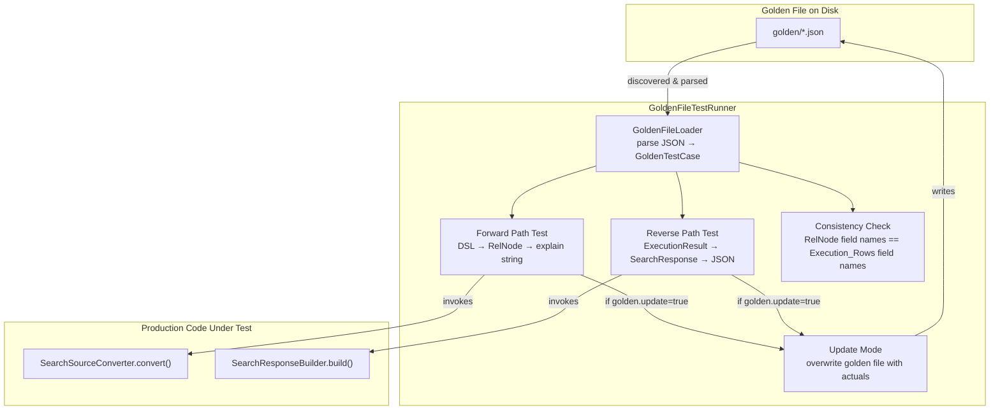
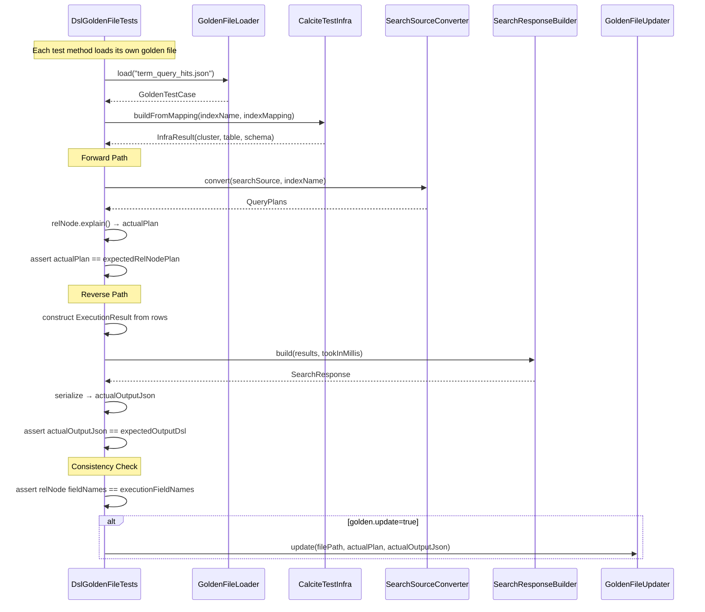

# Design Document: DSL Golden Tests

## Overview

This design describes a golden-file-based test framework for the `dsl-query-executor` plugin. The framework validates two conversion paths:

1. **Forward Path**: DSL (`SearchSourceBuilder`) → Calcite `RelNode` logical plan via `SearchSourceConverter.convert()`
2. **Reverse Path**: Simulated `ExecutionResult` rows → `SearchResponse` via `SearchResponseBuilder.build()`

Each golden file is a self-contained JSON document encoding the input DSL, expected RelNode plan string, simulated execution rows, and expected output DSL. Each test method loads its own specific golden file by name rather than bulk-discovering all files — this keeps tests explicit and avoids hidden coupling between test cases.

The framework runs as pure unit tests with zero cluster dependency. It constructs Calcite infrastructure (RelOptCluster, type factory, catalog reader) directly in test setup, mirroring the pattern already established in `TestUtils` and `SearchSourceConverterTests`.

A system-property-driven update mode (`-Dgolden.update=true`) allows developers to regenerate golden files after intentional conversion logic changes, keeping maintenance low.

## Architecture



The architecture has three layers:

1. **Data Layer** — `GoldenTestCase` POJO and `GoldenFileLoader` handle JSON parsing of individual golden files from the resources directory.
2. **Test Runner Layer** — Dedicated test methods in `DslGoldenFileTests` each load their own golden file by name, executing forward path, reverse path, and consistency checks.
3. **Update Layer** — When `golden.update=true`, the runner overwrites the golden file's expected fields with actual outputs instead of asserting.

### Key Design Decisions

- **Per-test golden file loading over bulk discovery**: Each test method explicitly loads its own golden file by name (e.g., `GoldenFileLoader.load("term_query_hits.json")`). This makes test dependencies explicit, avoids hidden coupling, and makes it clear which test covers which scenario.
- **JSON golden files over YAML/text**: JSON is natively supported by OpenSearch's `XContentParser` and `SearchSourceBuilder.fromXContent()`, avoiding extra dependencies.
- **Deterministic RelNode serialization**: Uses `RelNode.explain()` with `RelWriterImpl` to produce a stable, human-readable plan string. This is Calcite's built-in mechanism and produces consistent output across runs.
- **Schema from golden file, not from cluster**: Each golden file carries an `indexMapping` field that the test uses to construct a Calcite `RelDataType` directly, eliminating any need for `IndexMappingClient` or a live cluster.

## Components and Interfaces

### GoldenTestCase

A POJO representing a single parsed golden file:

```java
public class GoldenTestCase {
    private String testName;
    private String indexName;
    private Map<String, String> indexMapping;      // field name → SQL type name
    private Map<String, Object> inputDsl;          // raw JSON map for SearchSourceBuilder
    private String expectedRelNodePlan;            // expected RelNode.explain() output
    private List<String> executionFieldNames;      // column names for execution rows
    private List<List<Object>> executionRows;      // simulated result rows
    private Map<String, Object> expectedOutputDsl; // expected SearchResponse JSON
    private String planType;                       // "HITS" or "AGGREGATION"
}
```

### GoldenFileLoader

Responsible for parsing individual golden files:

```java
public class GoldenFileLoader {
    /** Parses a single golden file by name from src/test/resources/golden/ */
    public static GoldenTestCase load(String goldenFileName);

    /** Parses a single golden file into a GoldenTestCase */
    public static GoldenTestCase load(Path goldenFilePath);

    /** Validates required fields are present, throws descriptive error if not */
    private static void validate(GoldenTestCase testCase, Path filePath);
}
```

### DslGoldenFileTests

Dedicated test methods, each loading its own golden file:

```java
public class DslGoldenFileTests extends OpenSearchTestCase {
    void testMatchAllHitsForwardPath();
    void testMatchAllHitsReversePath();
    void testTermQueryHitsForwardPath();
    void testTermQueryHitsReversePath();
    // ... one pair of test methods per golden file
    
    /** Shared helper: loads golden file, runs forward path, asserts or updates */
    private void runForwardPathTest(String goldenFileName);
    
    /** Shared helper: loads golden file, runs reverse path, asserts or updates */
    private void runReversePathTest(String goldenFileName);
    
    /** Shared helper: loads golden file, checks field name consistency */
    private void runConsistencyCheck(String goldenFileName);
}
```

### GoldenFileUpdater

Handles the update-mode logic:

```java
public class GoldenFileUpdater {
    /** Returns true if -Dgolden.update=true is set */
    public static boolean isUpdateMode();

    /** Overwrites the expected fields in the golden file with actual values */
    public static void update(Path goldenFilePath, String actualRelNodePlan,
                              Map<String, Object> actualOutputDsl);
}
```

### CalciteTestInfra

Extends the existing `TestUtils` pattern to support dynamic schemas from golden files:

```java
public class CalciteTestInfra {
    /** Builds a RelOptCluster, schema, and catalog reader from a golden file's indexMapping */
    public static InfraResult buildFromMapping(String indexName, Map<String, String> indexMapping);

    public record InfraResult(
        RelOptCluster cluster,
        RelOptTable table,
        SchemaPlus schema
    ) {}
}
```

### Interaction Flow



## Data Models

### Golden File JSON Schema

```json
{
  "testName": "term_query_hits",
  "indexName": "test-index",
  "indexMapping": {
    "name": "VARCHAR",
    "price": "INTEGER",
    "brand": "VARCHAR",
    "rating": "DOUBLE"
  },
  "planType": "HITS",
  "inputDsl": {
    "query": {
      "term": { "name": { "value": "laptop" } }
    },
    "size": 10
  },
  "expectedRelNodePlan": "LogicalSort(fetch=[10])\n  LogicalProject(name=[$0], price=[$1], brand=[$2], rating=[$3])\n    LogicalFilter(condition=[=($0, 'laptop')])\n      LogicalTableScan(table=[[test-index]])\n",
  "executionFieldNames": ["name", "price", "brand", "rating"],
  "executionRows": [
    ["laptop", 999, "BrandA", 4.5],
    ["laptop", 1299, "BrandB", 4.8]
  ],
  "expectedOutputDsl": {
    "hits": {
      "total": { "value": 2, "relation": "eq" },
      "hits": [
        { "_source": { "name": "laptop", "price": 999, "brand": "BrandA", "rating": 4.5 } },
        { "_source": { "name": "laptop", "price": 1299, "brand": "BrandB", "rating": 4.8 } }
      ]
    }
  }
}
```

### Aggregation Golden File Example

Aggregation test cases use the same schema as hits — no separate metadata needed. The aggregation structure is fully captured in the `inputDsl` (which drives `SearchSourceConverter.convert()`) and validated via the `expectedRelNodePlan` output:

```json
{
  "testName": "terms_with_avg_aggregation",
  "indexName": "test-index",
  "indexMapping": {
    "name": "VARCHAR",
    "price": "INTEGER",
    "brand": "VARCHAR",
    "rating": "DOUBLE"
  },
  "planType": "AGGREGATION",
  "inputDsl": {
    "size": 0,
    "aggregations": {
      "by_brand": {
        "terms": { "field": "brand" },
        "aggregations": {
          "avg_price": { "avg": { "field": "price" } }
        }
      }
    }
  },
  "expectedRelNodePlan": "LogicalAggregate(group=[{2}], avg_price=[AVG($1)])\n  LogicalTableScan(table=[[test-index]])\n",
  "executionFieldNames": ["brand", "avg_price"],
  "executionRows": [
    ["BrandA", 850.0],
    ["BrandB", 1100.0]
  ],
  "expectedOutputDsl": {
    "aggregations": {
      "by_brand": {
        "buckets": [
          { "key": "BrandA", "doc_count": 0, "avg_price": { "value": 850.0 } },
          { "key": "BrandB", "doc_count": 0, "avg_price": { "value": 1100.0 } }
        ]
      }
    }
  }
}
```

### SQL Type Mapping

The `indexMapping` field uses Calcite `SqlTypeName` strings. The mapping from golden file to Calcite types:

| Golden File Type | SqlTypeName | Java Type |
|---|---|---|
| `VARCHAR` | `SqlTypeName.VARCHAR` | `String` |
| `INTEGER` | `SqlTypeName.INTEGER` | `Integer` |
| `BIGINT` | `SqlTypeName.BIGINT` | `Long` |
| `DOUBLE` | `SqlTypeName.DOUBLE` | `Double` |
| `FLOAT` | `SqlTypeName.FLOAT` | `Float` |
| `BOOLEAN` | `SqlTypeName.BOOLEAN` | `Boolean` |
| `DATE` | `SqlTypeName.DATE` | `Date` |
| `TIMESTAMP` | `SqlTypeName.TIMESTAMP` | `Timestamp` |

All fields are created as nullable (matching `OpenSearchSchemaBuilder` behavior observed in `TestUtils`).

### File Organization

```
sandbox/plugins/dsl-query-executor/
├── src/test/
│   ├── java/org/opensearch/dsl/golden/
│   │   ├── GoldenTestCase.java
│   │   ├── GoldenFileLoader.java
│   │   ├── GoldenFileUpdater.java
│   │   ├── CalciteTestInfra.java
│   │   └── DslGoldenFileTests.java
│   └── resources/golden/
│       ├── match_all_hits.json
│       ├── term_query_hits.json
│       ├── range_query_hits.json
│       ├── bool_query_hits.json
│       ├── sort_and_size_hits.json
│       ├── terms_with_avg_aggregation.json
│       ├── standalone_avg_metric.json
│       ├── cardinality_metric.json
│       ├── multi_terms_aggregation.json
│       └── hits_and_aggregation_combined.json
```

## Correctness Properties

*A property is a characteristic or behavior that should hold true across all valid executions of a system — essentially, a formal statement about what the system should do. Properties serve as the bridge between human-readable specifications and machine-verifiable correctness guarantees.*

### Property 1: Golden file serialization round-trip

*For any* valid `GoldenTestCase` containing a test name, index name, index mapping, input DSL, expected RelNode plan, execution field names, execution rows, and expected output DSL, serializing the test case to JSON and then parsing it back via `GoldenFileLoader.load()` should produce a `GoldenTestCase` with all fields equal to the original.

**Validates: Requirements 1.1, 2.2, 2.3, 2.4**

### Property 2: Validation rejects golden files with missing required fields

*For any* golden file JSON object where one or more required fields (testName, indexName, indexMapping, inputDsl, expectedRelNodePlan, executionFieldNames, executionRows, expectedOutputDsl) have been removed, `GoldenFileLoader.load()` should throw an error whose message identifies the specific missing field.

**Validates: Requirements 2.5**

### Property 3: File discovery completeness

*For any* directory containing N `.json` files (where N >= 0), `GoldenFileLoader.loadAll()` should return exactly N `GoldenTestCase` instances, one per file.

**Validates: Requirements 2.1**

### Property 4: Forward path produces a valid plan for any well-formed DSL

*For any* valid `SearchSourceBuilder` and matching index schema (as defined by a golden file's `indexMapping`), invoking `SearchSourceConverter.convert()` should produce a non-null `QueryPlans` containing at least one `QueryPlan` whose `RelNode` has a non-empty row type.

**Validates: Requirements 3.2**

### Property 5: RelNode serialization is deterministic

*For any* `RelNode` produced by `SearchSourceConverter.convert()`, calling `relNode.explain()` twice should produce identical strings.

**Validates: Requirements 3.3**

### Property 6: JSON comparison ignores non-deterministic fields

*For any* two SearchResponse JSON objects that are identical except for the values of `took` and shard count fields (`total`, `successful`, `skipped`, `failed` under `_shards`), the framework's comparison function should report them as equal.

**Validates: Requirements 4.4**

### Property 7: Forward and reverse path field name consistency

*For any* golden file where the forward path produces a `RelNode`, the output field names of that `RelNode` (from `relNode.getRowType().getFieldNames()`) should exactly equal the `executionFieldNames` list in the golden file.

**Validates: Requirements 5.1**

### Property 8: Update mode preserves inputs while replacing outputs

*For any* golden file on disk, when `golden.update=true` is set and the test runner executes, the resulting file should have its `inputDsl`, `executionFieldNames`, `executionRows`, `indexName`, and `indexMapping` fields unchanged from the original, while `expectedRelNodePlan` and `expectedOutputDsl` should equal the actual computed values.

**Validates: Requirements 8.1, 8.2**

## Error Handling

### Golden File Loading Errors

| Error Condition | Behavior |
|---|---|
| Golden file contains invalid JSON | `GoldenFileLoader` throws `IllegalArgumentException` with file path and parse error details |
| Required field missing from golden file | `GoldenFileLoader.validate()` throws `IllegalArgumentException` naming the missing field and file path |
| `indexMapping` contains unsupported SQL type | `CalciteTestInfra.buildFromMapping()` throws `IllegalArgumentException` naming the unsupported type |
| `indexName` not found in constructed schema | `SearchSourceConverter.convert()` throws `IllegalArgumentException` (existing behavior) |

### Forward Path Errors

| Error Condition | Behavior |
|---|---|
| DSL contains unsupported query type | `ConversionException` propagates from `FilterConverter` with query type details |
| DSL references field not in schema | `ConversionException` from the relevant converter (Filter, Project, or Sort) |
| RelNode plan mismatch (non-update mode) | JUnit assertion failure showing expected vs actual plan strings |

### Reverse Path Errors

| Error Condition | Behavior |
|---|---|
| `SearchResponseBuilder.build()` fails | Exception propagates as test failure with stack trace |
| Output DSL mismatch (non-update mode) | JUnit assertion failure showing expected vs actual JSON |
| Field name consistency check fails | JUnit assertion failure listing expected field names (from RelNode) vs actual (from golden file) |

### Update Mode Errors

| Error Condition | Behavior |
|---|---|
| Cannot write to golden file (permissions) | `IOException` propagates as test failure |
| Golden file updated successfully | Warning logged: "GOLDEN FILE UPDATED: {filePath} — review the diff before committing" |

## Testing Strategy

### Unit Testing Approach

**Unit tests** validate specific golden file scenarios (Requirements 6 and 7) and error conditions. Each golden file (match_all, term query, range query, bool query, sort/size, terms+avg, standalone metric, cardinality, multi_terms, hits+aggregation combined) has dedicated test methods that exercise the forward and reverse paths with concrete, known inputs and expected outputs.

### Test Organization

| Test Class | Type | What It Tests |
|---|---|---|
| `DslGoldenFileTests` | Unit | Forward path, reverse path, and consistency — dedicated methods per golden file |
| `CalciteTestInfraTests` | Unit | Schema construction from index mappings |

### Unit Test Coverage Map

| Golden File | Requirements Covered | Pipeline |
|---|---|---|
| `match_all_hits.json` | 6.1 | Scan→Project→Sort |
| `term_query_hits.json` | 6.2 | Scan→Filter→Project→Sort |
| `range_query_hits.json` | 6.3 | Scan→Filter→Project→Sort |
| `bool_query_hits.json` | 6.4 | Scan→Filter→Project→Sort |
| `sort_and_size_hits.json` | 6.5 | Scan→Filter→Project→Sort (explicit sort + size) |
| `terms_with_avg_aggregation.json` | 7.1 | Scan→Filter→Aggregate |
| `standalone_avg_metric.json` | 7.2 | Scan→Aggregate (size=0) |
| `cardinality_metric.json` | 7.3 | Scan→Aggregate |
| `multi_terms_aggregation.json` | 7.4 | Scan→Aggregate |
| `hits_and_aggregation_combined.json` | 7.5 | Both HITS and AGGREGATION plans |

### Build Integration

Tests run as part of the standard `testImplementation` source set:
- `gradle test` runs all golden file tests
- `brazil-build release` includes them in the standard build cycle
- No cluster required — all tests are pure unit tests
- Update mode: `gradle test -Dgolden.update=true` regenerates expected values

### Future Extension: Property-Based Testing

The correctness properties defined above can be validated using property-based testing (PBT) with [jqwik](https://jqwik.net/), a JUnit 5 PBT engine. This would add a `testImplementation 'net.jqwik:jqwik:1.9.1'` dependency and validate universal invariants (serialization round-trips, validation rejection, deterministic serialization, etc.) across randomly generated inputs. This is deferred for now but the properties are documented above for future implementation.

Potential PBT test classes when implemented:
- `GoldenFileLoaderPropertyTests` — Properties 1, 2, 3
- `GoldenFileUpdaterPropertyTests` — Property 8
- `JsonComparisonPropertyTests` — Property 6
- `RelNodeSerializationPropertyTests` — Property 5
