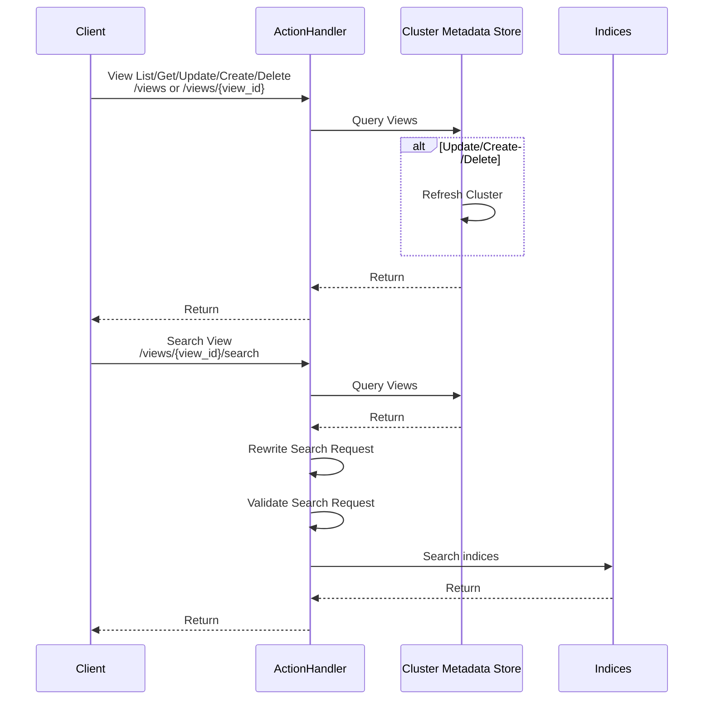

# Views

Views define how searches are performed against indices on a cluster, uniform data access that is configured separately from the queries.


## Design




### Local Testing

```
curl localhost:9200/abc/_doc \
 -XPOST \
 --header "Content-Type: application/json" \
 --data '{"foo":"bar"}' \

curl localhost:9200/views \
 -XPOST \
 --header "Content-Type: application/json" \
 --data '{"name":"hi", "createdAt": -1, "modifiedAt": -1, "targets":[]}' \
 -v

curl localhost:9200/views \
 -XPOST \
 --header "Content-Type: application/json" \
 --data '{"name":"hi", "createdAt": -1, "modifiedAt": -1, "targets":[{"indexPattern":"abc"}]}' \
 -v


curl localhost:9200/views/hi/_search
```

## Appendix

VIEW MODEL
{
   name: STRING,        // [Optional] Friendly name resolves to ID
   id: STRING,          // Non-mutatable identifier
   description: STRING, // [Optional] Description of the view
   created: DATE,       // Creation time of the view
   modified: DATE       // Last modified time of the view
   query: QUERY,        // enforced query
   filter: QUERY,       // P2 enforced query after transformations
   targets: [
      {
         indexPattern: STRING, // No wildcard/aliases!
                               // P2 Allow wildcard/aliases query parameter
         query: QUERY,         // enforced query specific for this target
         filter: QUERY,        // P2 enforced query specific after transformations
         documentTransformer: SCRIPT // P2 Convert the results in some way
      }
   ],
   documentTransformer: SCRIPT  // P2 Convert the results in some way
}


View Operations
POST   /views
GET    /views/{view_id}
PUT    /views/{view_id}
PATCH  /views/{view_id}
DELETE /views/{view_id}

Enumerate Views
GET    /views

Search Views // P2?
GET    /views/_search
POST   /views/_search

Mapping // P2?  Need to understand the utility / impact of not having this
GET    /views/{view_id}/_mappings
PUT    /views/{view_id}/_mappings
PATCH  /views/{view_id}/_mappings

Search Views
GET    /views/{view_id}/_search
POST   /views/{view_id}/_search

// Results do not include any fields '_', how to protect leaking data?


### Response on Create/Enumerate/Search

views: [
   {
      name: STRING,
      id: STRING,
      description: STRING,
      created: DATE,
      modified: DATE
   }
]


## Permissions

Views can be permissioned directly by name or id.  User must also have READ permission for all indices targeted by the view, authorized before any of these operations.

index:views.view.read[:{view_id}]
index:views.view.modify[:{view_id}]
index:views.view.delete[:{view_id}]

Searching with a view. Read permission of the view is *not* required.

index:views.view.search[:{view_id}]

Creation / Enumeration / Searching views is supported.  Only the view name and view id are returned.  Create view call requires READ permission for all indices targeted by the view.

index:views.enumerate
index:views.search
index:views.create 

### Internal functionality

Search does not expose information about the targets or associated mappings.  Internally used to resolve all indices and check permissions.

GET /views/{view_id}/_resolveTargets

{
targets: [
   {
      index: STRING,
      fields: [
         {
            fieldName: STRING
         }
      ],
      _view: VIEW_MIN_OBJECT
   }, ...
],
fields: [ FIELD_NAME,... ]
}


