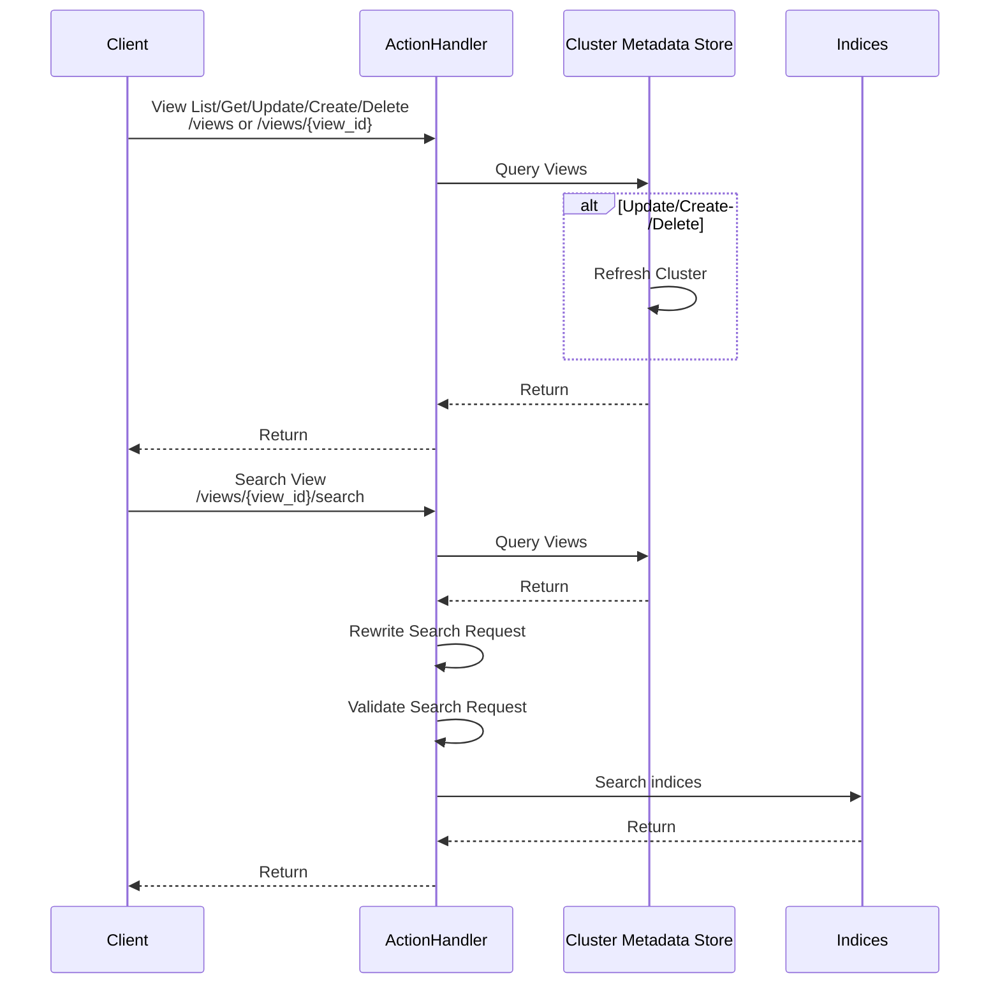

# Views

Views define how searches are performed against indices on a cluster, uniform data access that is configured separately from the queries.

## Design

```mermaid
sequenceDiagram
    participant Client
    participant HTTP_Request as ActionHandler
    participant Cluster_Metadata as Cluster Metadata Store
    participant Data_Store as Indices

    Client->>HTTP_Request: View List/Get/Update/Create/Delete<BR>/views or /views/{view_id}
    HTTP_Request->>Cluster_Metadata: Query Views
    alt Update/Create/Delete
        Cluster_Metadata->>Cluster_Metadata: Refresh Cluster
    end
    Cluster_Metadata-->>HTTP_Request: Return
    HTTP_Request-->>Client: Return

    Client->>HTTP_Request: Search View<br>/views/{view_id}/search
    HTTP_Request->>Cluster_Metadata: Query Views
    Cluster_Metadata-->>HTTP_Request: Return
    HTTP_Request->>HTTP_Request: Rewrite Search Request
    HTTP_Request->>HTTP_Request: Validate Search Request
    HTTP_Request->>Data_Store: Search indices
    Data_Store-->>HTTP_Request: Return
    HTTP_Request-->>Client: Return
```

