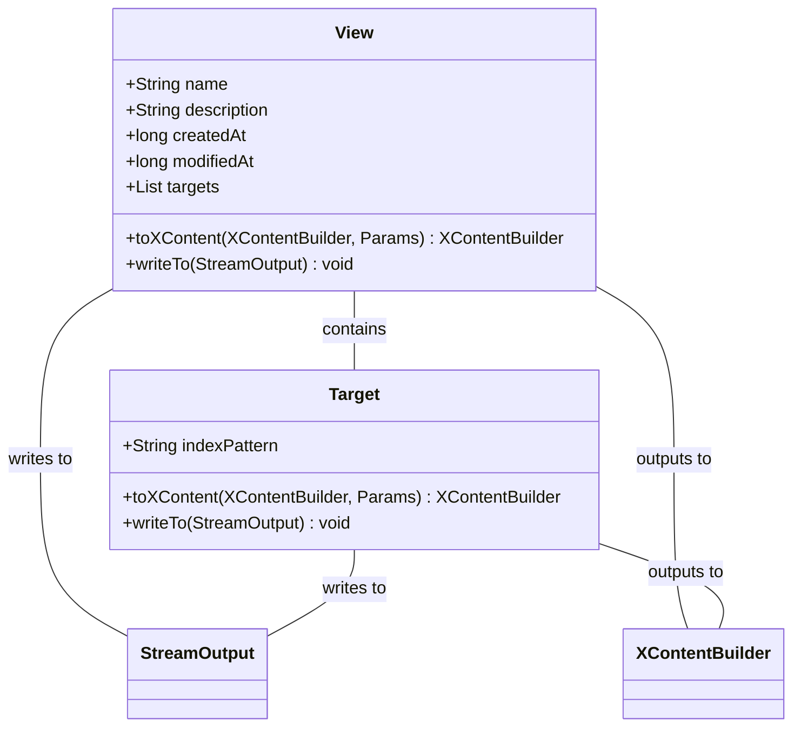
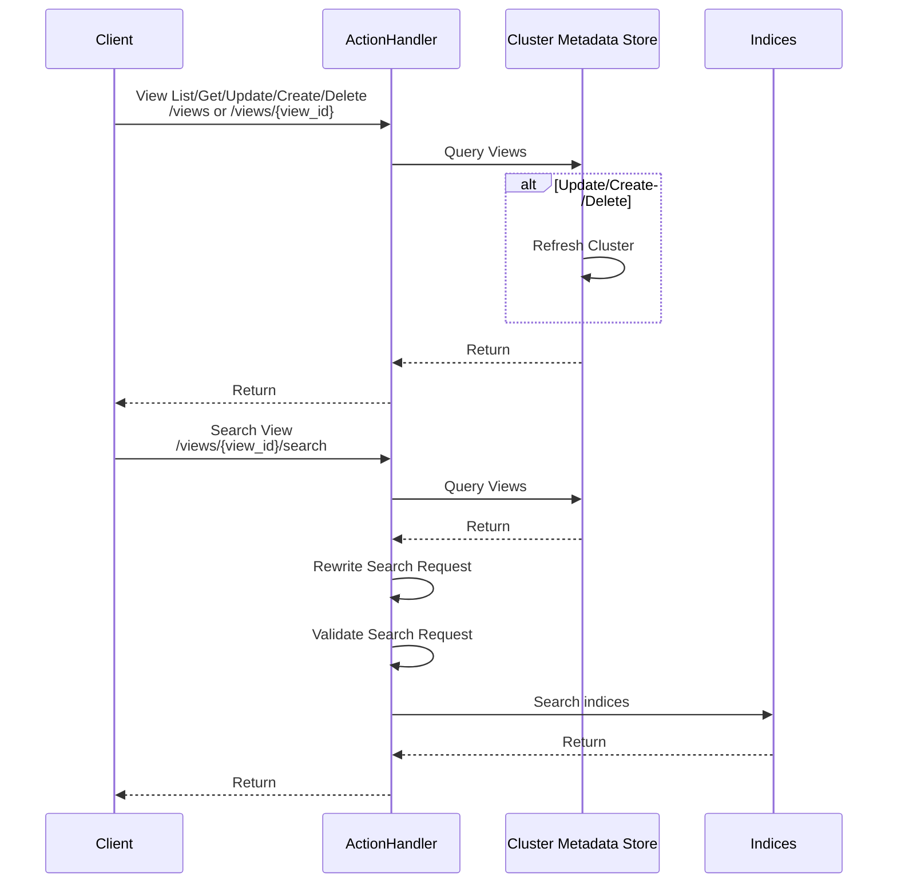

# Views

Views define how searches are performed against indices on a cluster, uniform data access that is configured separately from the queries.

## Design

### View data

Views create a mapping to the resources that hold information to be searched over in a consistent manner.  This abstraction allows for indirection with the backing indices, so they might be changed without callers being impacted.  This can also be used to simplify the security model - searches over views do not require permissions to the backing indices only permissions to the view itself.



### View persistence

Views are long lived objects in OpenSearch, all operations on them should be fully committed before responding to the caller.  Views are intentionally created for user scenarios following a similar creation cadence to indices.

Committed implies that the updates are synchronized across all nodes in a cluster.  The Cluster Metadata Store is already available and allows for acknowledging that changes have been applied to all nodes.  While this data could be stored in a new purpose built index, index data replication has delays and ensuring synchronization is non-trivial to implement as is seen in the Security plugins [1].

- [1] https://github.com/opensearch-project/security/issues/3275


## Appendix

### Local Testing

```
curl localhost:9200/abc/_doc \
 -XPOST \
 --header "Content-Type: application/json" \
 --data '{"foo":"bar"}' \

curl localhost:9200/views \
 -XPOST \
 --header "Content-Type: application/json" \
 --data '{"name":"hi", "createdAt": -1, "modifiedAt": -1, "targets":[]}' \
 -v

curl localhost:9200/views \
 -XPOST \
 --header "Content-Type: application/json" \
 --data '{"name":"hi", "createdAt": -1, "modifiedAt": -1, "targets":[{"indexPattern":"abc"}]}' \
 -v


curl localhost:9200/views/hi/_search
```

### v0 View Data Model

```
VIEW MODEL
{
   name: STRING,        // [Optional] Friendly name resolves to ID
   id: STRING,          // Non-mutatable identifier
   description: STRING, // [Optional] Description of the view
   created: DATE,       // Creation time of the view
   modified: DATE       // Last modified time of the view
   query: QUERY,        // enforced query
   filter: QUERY,       // P2 enforced query after transformations
   targets: [
      {
         indexPattern: STRING, // No wildcard/aliases!
                               // P2 Allow wildcard/aliases query parameter
         query: QUERY,         // enforced query specific for this target
         filter: QUERY,        // P2 enforced query specific after transformations
         documentTransformer: SCRIPT // P2 Convert the results in some way
      }
   ],
   documentTransformer: SCRIPT  // P2 Convert the results in some way
}
```

#### View Operations

| Method | Path |
| - | - |
| POST   | /views |
| GET    | /views/{view_id} |
| PUT    | /views/{view_id} | 
| PATCH  | /views/{view_id} | 
| DELETE | /views/{view_id} |

#### Enumerate Views

| Method | Path |
| - | - |
| GET | /views |

#### Perform a Search on a view
| Method | Path |
| - | - |
| GET  | /views/{view_id}/_search |
| POST | /views/{view_id}/_search |

#### Search Views // P2?
| Method | Path |
| - | - |
| GET  | /views/_search |
| POST | /views/_search |

#### Mapping // P2?  Need to understand the utility / impact of not having this
| Method | Path |
| - | - |
| GET   | /views/{view_id}/_mappings |
| PUT   | /views/{view_id}/_mappings |
| PATCH | /views/{view_id}/_mappings |


*Results do not include any fields '_', how to protect leaking data?*

#### Response on Create/Enumerate/Search

views: [
   {
      name: STRING,
      id: STRING,
      description: STRING,
      created: DATE,
      modified: DATE
   }
]
